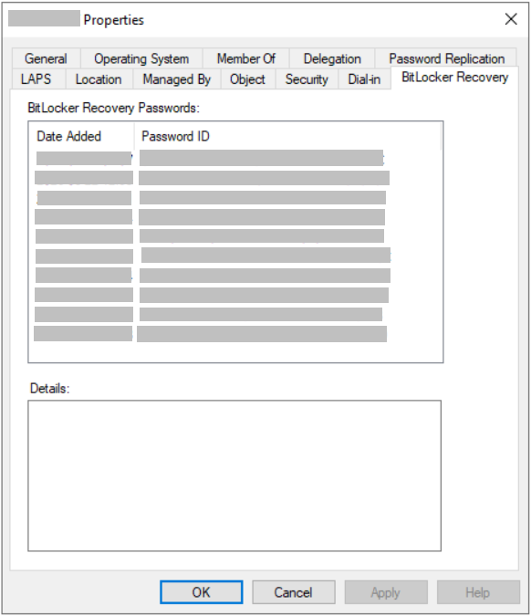
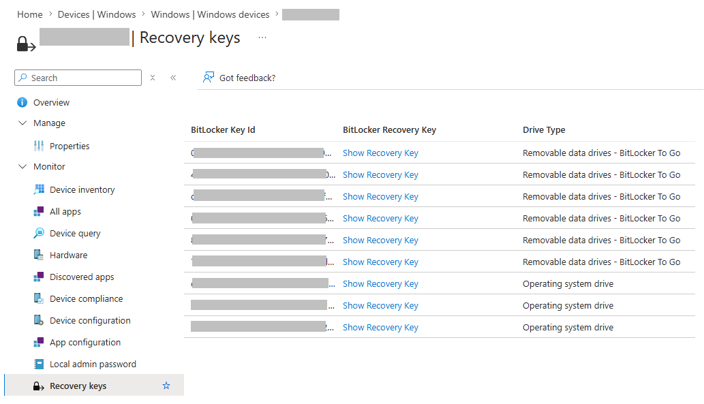
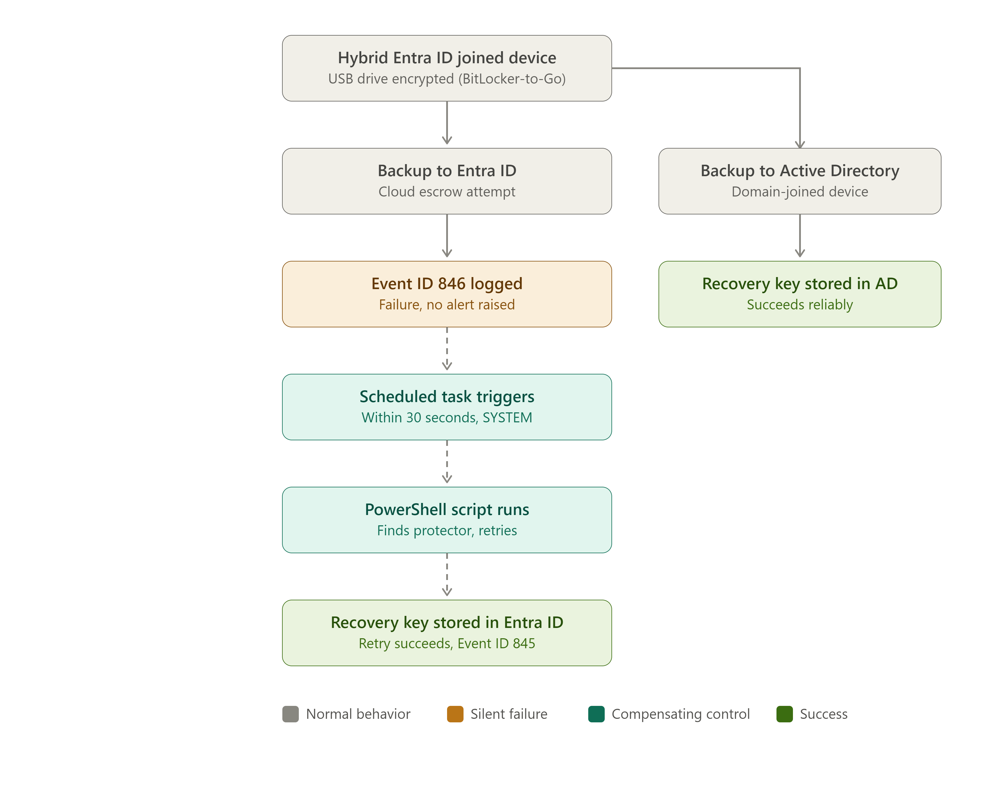

# BitLocker-to-Go Recovery Key Escrow via Event-Driven Retry
*A Compensating Control for Hybrid Entra ID Devices*

---

| | |
|---|---|
| **Version** | 1.4 |
| **Author** | Shirish Mistry |
| | Associate Principal, Endpoint & Security Architecture |
| **Date** | June 2026 |
| **Repository** | github.com/Shirish03/windows-endpoint-security-patterns |

---

## Executive Summary

Windows BitLocker-to-Go encrypts removable USB drives. On Hybrid Entra ID
joined devices, BitLocker recovery keys are designed to back up to both
Active Directory and Microsoft Entra ID. The Active Directory path is a
mature, long-standing mechanism. Organisations frequently also configure
escrow to Entra ID specifically, not as redundancy, but because Active
Directory's BitLocker Recovery view does not distinguish a removable
drive's recovery key from an operating system drive's, while Entra ID
labels each key by drive type, and because Entra ID supports delegating
helpdesk access to recovery keys through role-based access control without
granting broader Active Directory permissions. On Hybrid Entra ID joined,
Intune-managed devices, this second escrow path, the backup to Entra ID,
silently fails. No alert is raised, no user is notified, and the device
reports as compliant, but the recovery key was never stored in Entra ID.

The result is a fleet of removable drives whose recovery keys are not
escrowed to Entra ID. Active Directory may hold a recovery password for
the same drive, but without drive-type labeling, identifying the correct
record during an urgent recovery is operationally difficult, and in
practice this gap can result in permanent data loss.

The recommended approach is an event-driven compensating control that
detects the platform's own failure signal and performs an automatic retry
using only native Windows components. No new infrastructure is required.
The control is auditable, scalable, and operates entirely within the
platform's existing security boundaries.

---

## 1. Background and Problem Context

### The Hybrid Entra ID Configuration Gap

Modern enterprise Windows estates are rarely fully cloud-native or fully
on-premises. The most common transitional state is Hybrid Entra ID join:
devices are joined to on-premises Active Directory, registered in
Microsoft Entra ID, and managed through a combination of Group Policy
and Microsoft Intune. This configuration unlocks cloud management
capabilities, including conditional access, Intune policy delivery, and
Autopilot provisioning, without requiring a full migration away from
on-premises directory infrastructure.

BitLocker recovery key escrow can target two separate destinations: Active
Directory Domain Services, for domain-joined and Hybrid Entra ID joined
devices, and Microsoft Entra ID, for Entra ID joined and Hybrid Entra ID
joined devices managed through Intune. Per Microsoft's documented
behaviour, a Hybrid Entra ID joined device is expected to back up to both
destinations when both are properly configured. The Active Directory path
is not affected by the issue this pattern addresses; it continues to
escrow reliably. This pattern specifically addresses the Entra ID half of
that dual-backup expectation, which silently fails on Hybrid Entra ID
joined devices.

BitLocker-to-Go, the variant of BitLocker that encrypts removable USB
drives rather than OS volumes, is expected to behave consistently with
OS drive BitLocker in this configuration. Group Policy and Intune CSP
settings exist to require recovery key backup to Entra ID. They deploy
without error. They appear in compliance reports. And on Hybrid Entra ID
joined devices, they do not produce the result they appear to produce:
the Entra ID portion of the recovery key backup for removable drives
silently fails at the platform level.

This is not a misconfiguration. The policy is correctly applied. The
failure occurs in the Windows BitLocker API's handling of the cloud
backup operation when the device identity context of a Hybrid Entra ID
joined device is involved. The result is a gap that is invisible to
standard configuration management tooling.

### Scale and Prevalence

Hybrid Entra ID join is the dominant configuration in enterprise Windows
estates undergoing cloud modernisation. Organisations that have not yet
completed a full Entra ID-only migration are operating devices in this
configuration. This describes the majority of mid-to-large enterprises
at any given point in that journey. Any of those devices on which a
user encrypts a removable USB drive is subject to this Entra ID escrow
failure.

The scale of the affected population is proportional to the scale of
the Hybrid Entra ID estate and the rate at which users encrypt removable
media. In environments where removable drive encryption is policy-required
or common practice, the number of drives without recovery keys escrowed
to Entra ID can accumulate silently across the fleet.

### Why Platform Documentation Does Not Surface This

Microsoft's documentation for BitLocker and Intune policy correctly
describes the configuration required to enable recovery key backup to
Entra ID. It does not document this specific failure mode for Hybrid
Entra ID joined devices with removable drives. The absence of
documentation creates false confidence. An administrator who has
correctly followed the documented configuration steps has no reason to
suspect the control is not functioning.

### Why Standard Monitoring Does Not Catch It

Windows generates Event ID 846 in the
`Microsoft-Windows-BitLocker/BitLocker Management` channel when recovery
key backup fails. This event is classified as Error level. However,
severity alone does not guarantee visibility: Event ID 846 is logged to a
provider-specific channel under Applications and Services Logs,
`Microsoft-Windows-BitLocker/BitLocker Management`, that most default
SIEM and monitoring configurations do not collect from. Standard
monitoring typically watches the core Windows channels (System,
Application, Security). An Error-level event in a channel nothing is
actively collecting from is just as invisible as a Warning-level event
in a commonly-watched one. Event ID 846 does not appear in Intune
compliance reports, is not surfaced in the Intune admin center as a
device health signal, and does not trigger any native administrative
notification.

The combination of an event logged to a channel most monitoring
configurations do not collect from, no platform alert, and correct policy
compliance reporting means this failure can persist indefinitely without
detection.

---

## 2. Risk and Compliance Implications

### Data Protection and Recovery Key Escrow

Recovery key escrow is not an administrative convenience; it is the
mechanism that makes encrypted data recoverable. When escrow silently
fails, the organisation holds encrypted removable drives with no
administrative path to recovery. A single hardware failure, forgotten
password, or staff departure involving an unescrowable drive results in
permanent data loss. The risk is proportional to the sensitivity of data
users place on removable media and the scale of the affected device
population.

### Why Entra ID Escrow Matters Even When Active Directory Escrow Works

Even in environments where Active Directory recovery key escrow is
configured and functioning reliably, it has a practical limitation for
removable drives: Active Directory's BitLocker Recovery view lists
recovery passwords by date and password ID only, with no indication of
which physical drive each one protects. An administrator or helpdesk
technician reviewing a device with several stored recovery passwords, some
for the operating system drive, some for removable drives encrypted at
different times, has no reliable way to identify which entry corresponds
to the specific USB drive in front of them (Figure 1).

*Figure 1 — Active Directory's BitLocker Recovery tab lists recovery
passwords with no indication of which drive each one belongs to.*

Microsoft Entra ID addresses this directly: each recovery key is labeled
by drive type, distinguishing 'Removable data drives - BitLocker To Go'
from 'Operating system drive' (Figure 2). This labeling makes Entra ID
escrow operationally useful in a way that Active Directory escrow, despite
being reliable, is not for this specific scenario.

*Figure 2 — Microsoft Entra ID labels each recovery key by drive type,
distinguishing removable BitLocker-to-Go drives from operating system
drives.*

Entra ID escrow also enables organisations to delegate helpdesk access to
BitLocker recovery keys through role-based access control, scoped
specifically to recovery key retrieval, without granting broader Active
Directory administrative permissions merely to allow staff to locate
recovery passwords. This is a meaningful least-privilege improvement over
relying on Active Directory access alone for this purpose.

A key technically escrowed in Active Directory but not identifiable by
drive type, or only retrievable by staff with broader directory access
than the task requires, is not equivalent in practice to a key escrowed
in Entra ID. This is why the Entra ID escrow failure addressed by this
pattern represents a real operational gap even in environments where
Active Directory escrow already works.

### What a Compliance Assessor Would Find

The Group Policy and Intune configurations that require recovery key
backup to Entra ID may be correctly deployed and will appear compliant
during a policy review. The failure is behavioural, not configurational.
An assessor who checks whether recovery keys are actually present in
Entra ID for enrolled devices would find them absent. The control is
configured but not functioning. This is a more significant finding than a
missing policy, because it demonstrates a gap between documented controls
and effective controls.

### Audit Exposure in Regulated Environments

In regulated environments where data protection controls are subject to
audit, the inability to demonstrate that recovery keys are held for
encrypted removable drives represents an audit finding against the
effectiveness of the encryption control. The fact that policy is
correctly configured does not satisfy an assessor looking for evidence
that the control functions in practice.

Organisations subject to data protection regulation, sector-specific
security standards, or internal audit requirements around encryption key
management should treat this gap as a control effectiveness failure
rather than a configuration item.

### Framework Alignment

Several widely adopted frameworks treat recovery key management as a
component of cryptographic control assurance:

- **NIST CSF Protect function (PR.DS)** requires that data at rest is
  protected and that protection mechanisms are verified in practice, not
  merely in configuration.
- **ISO/IEC 27001 Annex A control A.8.24** addresses the use of
  cryptography and the management of cryptographic keys, including the
  requirement that key management processes are effective.
- **General data protection principles**, including those underpinning
  regional data protection legislation, require that technical controls
  protecting personal data are effective in practice.

Silent escrow failure creates a gap that is relevant across all of these.
This document does not constitute legal or compliance advice; organisations
should assess applicability to their specific obligations.

---

## 3. Architecture Overview

### How the Compensating Control Works

The solution treats Windows Event ID 846, the platform's own recovery
key backup failure signal, as a deterministic trigger for an automated
retry. When BitLocker-to-Go fails to back up a recovery key, Windows
logs this event. An event-triggered scheduled task detects it within
30 seconds and invokes a PowerShell script that retries the escrow
operation using native BitLocker APIs.

The entire mechanism operates within components and trust relationships
already present on the endpoint. No new infrastructure is introduced,
no credentials are handled by the solution, and no background agents are
required.

### Architecture Flow

*Figure 3 — BitLocker-to-Go dual-destination escrow: Active Directory
succeeds, Entra ID fails and triggers an automated retry.*

The diagram illustrates the dual-destination escrow design on a Hybrid
Entra ID joined device: the Active Directory escrow path succeeds, while
the Entra ID escrow path fails and triggers the automated retry chain
described in the component roles below.

### Component Roles

**Event ID 846: the trigger**
Windows emits this event when BitLocker-to-Go fails to back up a
recovery key to Entra ID. The event includes the affected drive letter
and is logged to the `Microsoft-Windows-BitLocker/BitLocker Management`
channel. The compensating control treats this event as a precise, reliable
signal rather than noise to suppress.

**Event-triggered scheduled task**
A scheduled task registered on the endpoint fires within 30 seconds of
Event ID 846. It executes under the SYSTEM context, ensuring consistent
behaviour regardless of the user session state, and invokes the
PowerShell escrow script. The task performs no logic itself; it is a
native dispatcher.

**PowerShell escrow script**
The script parses the triggering event, extracts the affected drive
letter, identifies RecoveryPassword key protectors on the volume, and
retries the Entra ID backup using the `BackupToAAD-BitLockerKeyProtector`
cmdlet. Every execution step, whether success or failure, is logged with
timestamp and context. No recovery key material is written to any log.

**Entra ID**
The device's existing trust relationship with Entra ID is used for the
escrow operation. The script does not handle credentials or tenant
identifiers. If the retry succeeds, the recovery key is visible in the
Entra ID portal under the device record.

For full implementation detail, including deployment steps, scheduled
task configuration, script parameters, and validation, refer to the
[GitHub pattern](https://github.com/Shirish03/windows-endpoint-security-patterns/tree/main/patterns/hybrid-entra-btg-key-escrow-pattern).

---

## 4. Design Rationale

### Event-Driven Over Polling

A polling approach would require periodically enumerating all
BitLocker-protected volumes across the device estate and determining
which recovery keys are absent from Entra ID. This creates a detection
lag proportional to the polling interval, requires persistent background
activity on every endpoint, and introduces complexity in determining which
missing keys represent genuine escrow failures versus those backed up
before the polling window.

The event-driven approach has none of these properties. It executes only
when a failure is detected, responds within 30 seconds, and has zero
overhead on devices that are not experiencing escrow failures. The
platform already emits a reliable failure signal; the question is whether
to act on it.

### Compensating Control Over Platform Replacement

The solution does not replace or modify the native BitLocker escrow
mechanism. It operates as a compensating control: a secondary measure
that detects and responds to native mechanism failures. This means the
native mechanism remains in place and may succeed on its own in some
scenarios; the compensating control only activates when it does not.

This design is deliberately conservative. A compensating control that
works within the platform's existing boundaries is easier to audit,
easier to explain to a security assessor, and less likely to introduce
new failure modes.

### What Was Considered and Rejected

**Intune Remediations** were evaluated as an alternative delivery
mechanism. Remediations run on a configurable schedule (minimum 15
minutes) and require cloud connectivity at execution time. The 15-minute
minimum latency and schedule-based execution make them unsuitable as a
response to a real-time failure signal. The event-driven approach
responds within 30 seconds and executes locally.

**Repeated retry loops** were considered and rejected. A single retry
per triggering event is sufficient: if the retry fails, the failure is
logged with full context, and the next Event ID 846, triggered if the
user re-enables BitLocker, will initiate a fresh attempt. Repeated
retries introduce log flooding risk and unpredictable behaviour under
load.

**Agent-based solutions** that introduce new software or persistent
background processes were not considered within scope. The requirement
to operate within the platform's existing boundaries ruled them out.

---

## 5. Operational Considerations

Full operational guidance, including monitoring, failure detection, log
locations, and lifecycle considerations, is documented in the
[Operational Guidance section](https://github.com/Shirish03/windows-endpoint-security-patterns/tree/main/patterns/hybrid-entra-btg-key-escrow-pattern#operational-guidance)
of the GitHub pattern.

In production, the primary signals to monitor are:

- **Event ID 845** following Event ID 846 on the same device, confirming
  the retry succeeded
- **Scheduled task last run result**: should be `0x0` in Task Scheduler
- **Script log file** at
  `C:\ProgramData\BitLocker\Logs\BTG_RecoveryKey_Escrow_Retry.log`,
  which records each execution with timestamp, drive letter, and outcome
- **Entra ID device record**: recovery keys should be present for all
  devices that have had removable drives encrypted

The solution requires no certificate renewal, no ongoing credential
management, and no persistent background process. The scheduled task
persists in the local task store across Intune re-enrollment. If the
device is re-imaged, the installer must be re-deployed as part of the
build process.

---

## 6. Recommendation

Organisations operating Windows devices in Hybrid Entra ID joined,
Intune-managed configurations should deploy this compensating control
to all endpoints where BitLocker-to-Go is enabled or where users may
encrypt removable USB drives. This control complements, rather than
replaces, Active Directory-based recovery key escrow where it is already
configured; it specifically ensures the Entra ID half of a
dual-destination escrow design actually functions as intended. The control
closes a silent, verified platform gap that cannot be addressed through
policy configuration alone. Deployment requires no new infrastructure,
introduces no new credentials or agents, and is reversible. The
operational overhead is low: the solution logs its own activity, integrates
with existing event monitoring, and requires no ongoing maintenance beyond
re-deployment at device re-image. Given the risk of permanent data loss
from unrecoverable encrypted drives, and the audit exposure in environments
where encryption key management is a documented control, deployment should
be treated as a baseline security measure rather than an optional
enhancement.

---

## 7. Further Reading

**GitHub pattern: full implementation reference**
The complete implementation, including deployment scripts, scheduled task
XML, validation steps, and operational guidance, is available at:
github.com/Shirish03/windows-endpoint-security-patterns/tree/main/patterns/hybrid-entra-btg-key-escrow-pattern

**Microsoft documentation**
- Microsoft Learn: BitLocker overview and recovery key management
- Microsoft Learn: Intune device configuration - BitLocker settings
- Microsoft Learn: Entra ID device management and BitLocker key recovery
- Windows Event Log reference: Microsoft-Windows-BitLocker/BitLocker Management

*Reference Microsoft documentation at learn.microsoft.com. Content and
URLs are subject to change; search by topic rather than direct URL.*

---

## 8. Disclaimer

This whitepaper is provided as reference material and architectural
guidance. The compensating control described has been validated in
specific Hybrid Entra ID and Intune-managed environment configurations
and may require adaptation for other configurations.

There is no guarantee that this approach will function identically in
all environments. Administrators should review, test, and validate
behaviour in a controlled setting before any production use.

This document does not constitute legal or compliance advice. Framework
references (NIST CSF, ISO/IEC 27001) are provided for context only.
Organisations should assess applicability to their specific regulatory
and contractual obligations independently.

Use at your own discretion.
