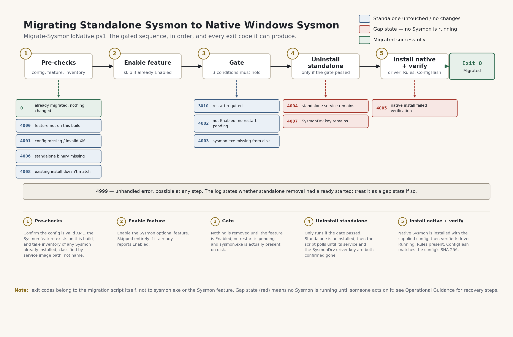

# Migrating Standalone Sysmon to Native Windows Sysmon
*A Gated Cutover Pattern for Zero-Gap Detection Coverage*

---

| | |
|---|---|
| **Version** | 1.0 |
| **Author** | Shirish Mistry |
| | Associate Principal, Endpoint & Security Architecture |
| **Domain** | Endpoint Security, Detection & Monitoring |
| **Date** | October 2026 |
| **Repository** | github.com/Shirish03/windows-endpoint-security-patterns |

---

## Executive Summary

Windows 11 24H2 and Windows Server 2025, with the March 2026 cumulative
update (KB5079473) or later, ship Sysmon as a built-in optional feature.
For over a decade, Sysmon has only existed as a third-party Sysinternals
download with no official Microsoft support path; this changes that.
Standalone Sysmon is not being deprecated and remains actively maintained,
so the case for migrating is not urgency for its own sake. It is that
native Sysmon updates through the normal Windows Update cycle, preserves
configuration across binary updates by Microsoft's own documentation, and
carries official support in a way the third-party download never has.

The two builds cannot run side by side. Both register their kernel driver
under the same name, and Microsoft does not support coexistence, so this
is a real cutover, not a phased rollout. An organisation moving a fleet
from standalone to native has to uninstall one build and install the
other, on every endpoint, and any gap in that sequence is a detection
coverage gap, not a configuration drift.

This pattern addresses that directly with a gated migration sequence: no
destructive step runs until every precondition is independently confirmed,
and every failure after the point of no return is logged as an explicit
gap state rather than folded into a generic error. The sequence was
deliberately tested to failure before being considered complete, not
validated only against the happy path. That testing surfaced two distinct
ways detection coverage can be lost during this transition: one visible
immediately, one silent until the next reboot. Both are addressed in this
document, and both are closed by the gated design described here.

---

## 1. Background and Problem Context

### The native Sysmon transition

Sysmon has functioned as a de facto standard for endpoint telemetry for
years, despite never having an official Microsoft support channel. The
binary is downloaded separately, installed manually or through
third-party deployment tooling, and updated only when someone notices a
new Sysinternals release and pushes it out. Native Sysmon, delivered as a
Windows optional feature, changes that relationship. Security fixes land
in the monthly cumulative update. Feature work ships through preview
updates first, the same path as the rest of the platform. And per
[Microsoft's own documentation](https://learn.microsoft.com/en-us/windows/security/operating-system-security/sysmon/overview),
configuration survives a binary update without needing to be reapplied.

None of this makes standalone Sysmon broken or unsafe to keep running. Its
version number typically runs ahead of native's, precisely because
someone has to track and push each Sysinternals release manually. The
reason to migrate is the absence of an official support path for running
a third-party download in production, not a defect in the tool itself.

### Why this is a cutover, not a coexistence story

Native and standalone Sysmon both register their kernel driver as
`SysmonDrv`. Microsoft does not support running both at once, and in
practice they cannot: installing one over the other collides at the
driver level. This rules out a phased rollout where both builds run in
parallel for a transition period. The migration has to uninstall
standalone and install native in a single pass, per machine, which means
every machine currently running standalone Sysmon under Windows 11 24H2
or Windows Server 2025 will eventually make this same transition, on a
timeline set by platform servicing rather than organisational preference.
Standalone's position only weakens over time relative to native's: every
cumulative update narrows the gap in capability while native accumulates
an official support history standalone will never have.

### Why standard migration playbooks miss this

The obvious version of this migration is three steps: enable the optional
feature, uninstall standalone, install native. That sequence looks
complete, and in a clean test run, it is. The problem is what it doesn't
anticipate. If the feature isn't actually ready when the uninstall runs,
or if the native install fails for any reason after standalone is
already gone, the machine is left with no Sysmon running and no
monitoring, and nothing about that state is visible unless someone is
watching the console at the exact moment it happens. A pilot that only
exercises the happy path will not find this, because the happy path
doesn't produce it. Finding it requires testing the migration against
deliberate failure, not just deliberate success, which is the basis for
the design described in this document.

---

## 2. Risk and Compliance Implications

### Detection coverage as a compliance control

Sysmon output is frequently the primary data source feeding SIEM and EDR
correlation for process creation, network connection, and registry
activity. Monitoring and audit frameworks generally treat security event
logging as a continuous control, one that is either operating or it
isn't, not one that is satisfied by having once been configured correctly.
A migration that can interrupt that data source, even briefly or only on
a subset of a fleet, is a continuity failure in a control the organisation
likely already represents as operating to auditors, regulators, or its
own leadership.

### Two distinct failure shapes, both found by deliberate testing

Testing this pattern to failure, not just to success, surfaced two
different ways a migration can cost detection coverage. Both were found
in a controlled test environment before this pattern went anywhere near
a production fleet; neither is a report of something that happened in
production.

**An acute gap.** An early version of the migration script had a bug in
how it handled a blank line standalone Sysmon's uninstall command writes
to stderr, which Windows PowerShell 5.1 turned into a terminating error
mid-uninstall. That crash left a test machine with standalone stopped but
still registered, no native Sysmon installed, and no Sysmon events being
generated at all, for somewhere between 8.5 and 15.5 minutes. It was only
caught because someone happened to be watching the test machine at the
time. No alert fired, because nothing about that state trips an alert on
its own; an endpoint with no Sysmon service running simply produces no
Sysmon events, which looks identical to an endpoint that has nothing to
log. This finding is what drove the gated design in Section 3: every
destructive step is now independently verified, and every failure after
the point of no return is logged as an explicit gap state, specifically
so this class of failure cannot occur silently.

**A latent gap.** Separately, testing deliberately supplied native Sysmon
with a config it would reject, to see what actually happens, rather than
assuming the obvious failure mode. The compiled `Rules` registry value
carries a binary format version distinct from the config's XML schema
version. A `Rules` blob compiled by one Sysmon build can be rejected by
another build even when the source XML is entirely valid, and the
rejection is quiet: Sysmon logs Event ID 255 ("incompatible") and keeps
running on whatever configuration was already loaded in memory.
`ConfigHash` does not change to reflect the rejected push, and the
`SysmonDrv` driver continues to report healthy throughout. The real
outage does not surface until the next reboot, when the service has no
in-memory fallback left and has to load `Rules` fresh from the registry.
At that point it logs two Event ID 255 entries and exits within about
five seconds, with the driver still showing as running. The gap between
a bad config push and a visible outage can run days or weeks, depending
entirely on when the machine next restarts.

### What a compliance assessor would find

In both failure shapes above, the platform-level signals a routine review
would check first, service status, driver status, recent configuration
state, do not reliably indicate a problem. A check that only confirms the
`SysmonDrv` driver is loaded and `ConfigHash` is populated, which is
exactly what a naive post-migration verification does, passes cleanly
during the latent-gap state described above. An assessor who went one
level deeper, confirming the `Sysmon` service is actually Running and
events are actually reaching the collection channel, not just that the
driver reports healthy, would find the gap. Most routine health checks do
not go that deep by default.

### Why this is a compliance concern, not just an operational one

Most monitoring and audit frameworks an organisation is likely already
measured against treat continuous security event logging as an operating
control, not a one-time configuration item: the expectation is that
detection coverage is in effect continuously, not that it was configured
correctly at some point in the past. A gap that can be silently
introduced by routine maintenance, and persist undetected until an
unrelated event such as a reboot exposes it, sits awkwardly against that
expectation however an individual organisation's own obligations happen
to be framed. This is worth weighing against whatever continuous
monitoring commitments already apply in a given environment, contractual,
regulatory, or internal, rather than treating it as a purely operational
detail.

This document does not constitute legal or compliance advice;
organisations should assess applicability to their specific obligations.

---

## 3. Architecture Overview

### The gated cutover

The migration proceeds through five stages, and nothing destructive
happens until every precondition for it has been independently confirmed:

1. **Pre-checks.** Confirm the supplied config file exists and is valid
   XML, confirm the `Sysmon` optional feature actually exists on this OS
   build, and take inventory of whatever Sysmon is already installed,
   classified by the service's binary image path rather than its service
   name (native and 32-bit standalone Sysmon can share a service name,
   which makes name-based detection unreliable). If a machine was already
   migrated with this exact config in an earlier run, this step detects
   that and exits cleanly without touching anything.
2. **Enable** the optional feature, skipped if it already reports
   Enabled.
3. **Gate.** Nothing is removed until three conditions hold simultaneously:
   the feature reports exactly Enabled, no restart is pending (checked
   against both Sysmon's own restart flag and the general Windows
   pending-reboot indicators, not Sysmon's flag alone), and the native
   binary actually exists on disk.
4. **Uninstall standalone**, only if the gate passed, then poll until both
   its service and the `SysmonDrv` driver key are confirmed gone.
5. **Install native** with the supplied config, then verify the driver is
   running, the `Rules` registry value is present, and the registered
   `ConfigHash` matches the SHA-256 of the supplied config.

*Figure 1 — The gated migration sequence. Nothing is removed until the
gate at stage 3 passes; every failure path after stage 4 begins is logged
as an explicit gap state.*

If the gate at stage 3 does not pass, standalone Sysmon is never touched,
and the machine is left exactly as it was found. If a failure occurs at
or after stage 4, once standalone removal has actually begun, it is
labelled a gap state in the log every time that happens, not only when it
happens to be caught by someone watching.

### Component roles

| Component | Role |
|---|---|
| Migration script | Executes the gated sequence, performs all verification, and is the sole source of the exit codes used for deployment reporting |
| Config file | Supplied once at migration time via `sysmon.exe -i`; later changes are delivered as a separate, independently tested package (see Section 4) |
| `Sysmon` optional feature | The native delivery mechanism; its presence and Enabled state are two of the three gate conditions |
| `SysmonDrv` driver | Shared by both builds under the same name, which is why the two cannot coexist and why driver state alone is an insufficient health signal |
| Deployment tool | Runs the script as a 64-bit process, stages the config file alongside it, and is expected to re-run the script automatically after a `3010` soft-reboot exit |
| `Microsoft-Windows-Sysmon/Operational` channel | Carries over unchanged across the migration; the only loss is the few seconds of events during the cutover itself |

Full implementation detail, including the complete exit code table,
packaging guidance for deployment tooling, and the PowerShell 5.1 quirks
the script specifically works around, is in the
[GitHub pattern](https://github.com/Shirish03/windows-endpoint-security-patterns/tree/main/patterns/sysmon-migration-standalone-to-native).

---

## 4. Design Rationale

### Gate before destroy

Nothing irreversible happens until every precondition has been confirmed
independently, not inferred from a single signal. This is a direct
response to the acute-gap finding in Section 2: a design that removes
standalone Sysmon before native's readiness is fully and independently
confirmed is a design that can leave a machine with nothing running,
precisely the failure testing found.

### Explicit gap-state logging over generic errors

Every failure that occurs after standalone removal has begun is logged as
a gap state, specifically and consistently, rather than as a generic
script error. A generic error gets triaged on its own merits and may not
be treated as urgent. A gap state is, by definition, a statement that the
machine is currently unmonitored, which is the information an operator
actually needs to prioritise correctly.

### Config delivery decoupled from the registry

This pattern does not carry forward the registry-based, Group
Policy-delivered configuration approach used for standalone Sysmon in
this organisation's predecessor pattern. Configuration is supplied once
at migration time, and later changes go out as a separate,
independently-deployed package using `sysmon.exe -c`, tested against the
specific binary build installed on the target machines before it goes
fleet-wide. This decision was made initially because of the Group Policy
refresh delay that approach already carried as a known tradeoff. The
latent-gap finding in Section 2 reinforced it after the fact: a
registry-based push has no natural way to confirm the blob it's
delivering was compiled by, and is compatible with, the exact binary
running on the target machine, which is precisely the condition that
produces a silent failure.

### What was considered and rejected

**Trusting the optional feature's reported state alone** was considered
and rejected. Testing found a case where `Get-WindowsOptionalFeature`
reported the feature as Enabled while a restart was still required,
because of pending servicing work unrelated to Sysmon itself. A gate that
relied on feature state alone would have proceeded into the uninstall
with a restart still pending. The gate checks `RestartNeeded` and the
general Windows pending-reboot indicators specifically because feature
state by itself was shown not to be trustworthy.

**Treating the `Sysmon` service's Running state as a pass condition** was
considered and rejected. It is checked and logged, but not as a
requirement for a successful exit. This is deliberate: the latent-gap
finding in Section 2 showed that the service can appear in a correct
state right up until the moment it stops, so a verification step that
only confirms Running would have missed exactly the condition this
pattern is designed to catch.

**Hardcoding a build number or KB requirement** as the eligibility check
was considered and rejected in favour of calling
`Get-WindowsOptionalFeature -Online -FeatureName Sysmon` directly and
treating its result as the requirement. This is the actual platform-level
eligibility test, it naturally excludes builds that haven't taken the
required cumulative update, and it does not need to be kept in sync with
future servicing changes the way a hardcoded version check would.

---

## 5. Operational Considerations

Full operational guidance, including recovery steps for each gap state,
rollback to standalone, and version-checking methods, is documented in
the [Operational Guidance section](https://github.com/Shirish03/windows-endpoint-security-patterns/tree/main/patterns/sysmon-migration-standalone-to-native#operational-guidance)
of the GitHub pattern.

In testing, a clean migration completed in 12 to 16 seconds end to end,
with the monitoring gap itself, the window between standalone's service
stopping and native's starting, measuring consistently at 5 to 6 seconds.
The event log channel carries over unchanged; events written before the
migration remain in place and forwarding configuration is unaffected.

The primary signals to monitor, both immediately after a migration and on
an ongoing basis afterward, are:

- **The `Sysmon` service is Running**, not just that the `SysmonDrv`
  driver reports healthy. The latent-gap finding in Section 2 makes this
  distinction operationally necessary, not optional.
- **Events are actually reaching** `Microsoft-Windows-Sysmon/Operational`,
  since a stopped service and a quiet channel look identical to a
  collector until someone checks the service state directly.
- **`ConfigHash` matches the SHA-256 of the currently intended config**,
  confirming the last config push, whether at migration or afterward,
  actually took effect.
- **Sysmon Event ID 255** containing "incompatible" or "Exit process",
  which is the platform's own signal that a `Rules` blob was rejected.

These same checks apply after any subsequent configuration change, and
after the fleet's first cumulative update following migration, for the
same underlying reason: none of the usual green-light signals (driver
loaded, registry populated) reliably distinguish a healthy state from the
latent-gap state described in Section 2.

---

## 6. Recommendation

Organisations running standalone Sysmon on Windows 11 24H2 or Windows
Server 2025 with the required cumulative update should adopt a gated
migration sequence, structured as described in this document, rather than
a direct enable-uninstall-install script, before any fleet-wide rollout
to native Sysmon. The naive three-command version is not unsafe because
of a flaw in native Sysmon itself; it is unsafe because it has no way to
detect or report the specific conditions under which a migration can
leave a machine unmonitored, conditions this document shows are real and
were found through deliberate testing rather than theorised. Piloting
through a deployment tool on a representative sample, confirming the
script runs as a 64-bit process, and confirming event collection
continues from each migrated machine, should precede any broader push.
Given that Sysmon output frequently underpins SIEM and EDR detection
coverage, and that both failure modes identified here are invisible to a
surface-level health check, this pattern should be treated as the
baseline method for this transition rather than an optional refinement
on top of a simpler script.

---

## 7. Further Reading

**GitHub pattern: full implementation reference**
The complete implementation, including the migration script, the full
exit code table, packaging guidance for deployment tooling, and
operational recovery procedures for every gap state, is available at:
github.com/Shirish03/windows-endpoint-security-patterns/tree/main/patterns/sysmon-migration-standalone-to-native

**Microsoft documentation**
- Microsoft Learn: Sysmon overview, including the native Windows feature
- Microsoft Learn: Windows optional features and `Get-WindowsOptionalFeature`
- Windows Event Log reference: `Microsoft-Windows-Sysmon/Operational`

*Reference Microsoft documentation at learn.microsoft.com. Content and
URLs are subject to change; search by topic rather than direct URL.*

---

## 8. Disclaimer

This whitepaper is provided as reference material and architectural
guidance. The pattern described has been validated against Windows 11
Enterprise LTSC 24H2 (Hyper-V Gen 2 VM) and Windows 11 Pro 25H2
(physical), both running native Sysmon 10.0.26100.8521, with standalone
Sysmon64 v14.16 as the migration source. Testing was performed running as
a local administrator from an elevated PowerShell 5.1 session. Running as
SYSTEM under a deployment tool, and operation on Windows Server 2025, have
not yet been exercised and should be the first things confirmed in any
pilot.

There is no guarantee that this approach will function identically in all
environments. Administrators should review, test, and validate behaviour
in a controlled setting before any production use.

This document does not constitute legal or compliance advice.
Organisations should assess applicability to their specific regulatory
and contractual obligations independently.

Use at your own discretion.
