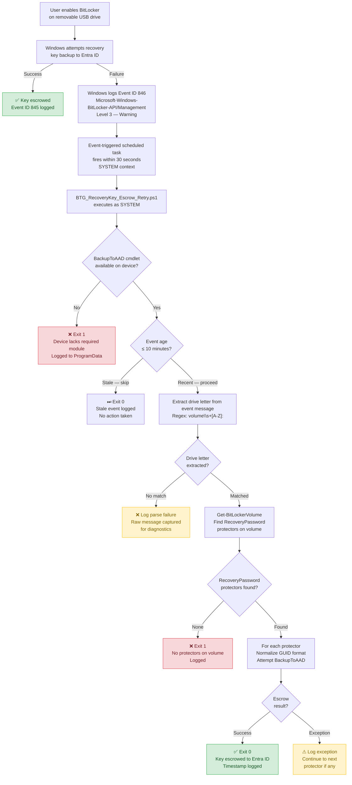

# BitLocker-to-Go Recovery Key Escrow (Hybrid Entra ID)

---
**Jump to section:**
[Strategic Overview](#strategic-overview) ·
[Architecture & Design](#architecture--design) ·
[Implementation Reference](#implementation-reference) ·
[Operational Guidance](#operational-guidance)

---

## Strategic Overview

### Who Should Read This

This document serves two audiences. Security architects and IT leadership
will find the strategic context, risk framing, and architectural
recommendation in this section. Engineers responsible for deploying and
operating the solution should proceed to
[Architecture & Design](#architecture--design) for design rationale,
[Implementation Reference](#implementation-reference) for deployment
steps, and [Operational Guidance](#operational-guidance) for monitoring
and failure handling.

---

### The Problem in Plain Terms

Windows can encrypt removable USB drives with BitLocker-to-Go and is
designed to automatically back up the recovery key to Entra ID, so
administrators can recover data if a user forgets their password or a
drive is damaged. On devices that are Hybrid Entra ID joined and managed
through Intune, this backup step silently fails. No alert is raised, no
user is notified, and the device appears policy-compliant — but the
recovery key was never stored. If the drive is ever needed for recovery,
the data is permanently unrecoverable.

---

### Risk and Compliance Implications

**Data recoverability**
Recovery key escrow is not a compliance checkbox — it is the mechanism
that makes encrypted data recoverable. When escrow silently fails, the
organisation holds encrypted removable drives with no administrative
path to recovery. A single hardware failure, forgotten password, or
staff departure involving an unescrowable drive results in permanent
data loss. The risk is proportional to the sensitivity of data users
place on removable media and the scale of the affected device population.

**What a compliance assessor would find**
The Group Policy and Intune configurations that require recovery key
backup to Entra ID may be correctly deployed and will appear compliant
during a policy review. The failure is behavioural, not configurational.
An assessor validating the control end-to-end — by checking whether
recovery keys are actually present in Entra ID for enrolled devices —
would find the keys absent. The control is configured but not
functioning, which is a more difficult finding to remediate than a
missing policy.

**Framework alignment**
Several widely adopted frameworks treat recovery key management as a
component of cryptographic control assurance. NIST CSF Protect function
(PR.DS) requires that data at rest is protected and that protection
mechanisms are verified. ISO/IEC 27001 Annex A control A.8.24 addresses
the use of cryptography and the management of cryptographic keys.
General data protection principles, including those underpinning
regional data protection legislation, require that technical controls
protecting personal data are effective in practice, not merely in
configuration. Silent escrow failure creates a gap that is relevant
across all of these. This document does not constitute legal or
compliance advice; organisations should assess applicability to their
specific obligations.

---

### Architectural Recommendation

Deploy an event-driven compensating control that intercepts the
platform's own failure signal and performs an immediate, automated
escrow retry. Windows emits a documented event when recovery key backup
fails; the recommended approach treats that event as a deterministic
trigger rather than a log entry to suppress. The solution operates
entirely within components and trust relationships already present on
the endpoint — no new infrastructure, no embedded credentials, no
background agents. This scope is deliberate: a compensating control
that works within the platform's established boundaries is auditable,
predictable, and safe to deploy at scale across a managed device
population.

---

## Architecture & Design

### Background

While backing up OS drive BitLocker recovery keys to Entra ID is well
supported today, BitLocker-to-Go recovery key escrow remains a gray area
when devices are **Hybrid Entra ID joined and Intune-managed**.

Although Group Policy and Intune CSPs exist to configure recovery key
backup behavior, Windows 10/11 does not natively and reliably escrow
**removable drive** recovery keys to Entra ID in this scenario.

This pattern documents a **design gap** identified during the migration
of an enterprise endpoint security control, and presents a practical,
event-driven workaround.

---

### Observed Platform Behaviour

When a user enables BitLocker on a removable USB drive on a Hybrid Entra
ID joined device, Windows generates the following event:

- **Log:** Microsoft-Windows-BitLocker-API/Management
- **Event ID:** 846
- **Behavior:**
  - Indicates failure to back up the BitLocker-to-Go recovery key
    to Entra ID
  - Includes the affected removable drive letter

Event ID 846 is classified as Level 3 — Warning. Windows treats the
backup failure as a warning rather than a hard error, which means there
is no automatic retry and no user-facing alert. The failure is easy to
miss without explicit log monitoring. This failure event becomes the
**trigger point** for the solution.

---

### Solution Overview

The solution implements an **automated retry mechanism** that reacts to
the BitLocker API failure event and programmatically performs recovery
key escrow.



> Color guide: green nodes = success paths, red = terminal failures,
> amber = logged errors with continuation.

---

### Component Overview

| Component | File | Purpose |
|-----------|------|---------|
| Scheduled Task XML | `tasks/BitLockerToGo-Escrow-Retry.xml` | Event-triggered task definition; fires within 30 seconds of Event ID 846 |
| Escrow Retry Script | `scripts/BTG_RecoveryKey_Escrow_Retry.ps1` | Parses the failure event, extracts drive letter, retries key backup to Entra ID |
| Installation Script | `scripts/Install-BTGRecoveryKeyEscrow.ps1` | Copies scripts to target path, registers scheduled task from XML |

---

### Key Design Principles

| Principle | Description |
|-----------|-------------|
| **Event-driven** | Executes only in response to a verified failure signal; no background polling |
| **Compensating control** | Complements native BitLocker behavior rather than replacing it |
| **Agentless** | Uses only built-in Windows components; no additional software required |
| **Auditable** | Produces structured log entries for every execution; no silent failures |
| **Scalable** | Consistent behavior across large endpoint populations via scheduled task deployment |
| **Bounded** | Single retry per triggering event; no recursive loops or persistent state |

---

### Design Trade-offs and Alternatives Considered

**Why event-driven rather than proactive polling?**
A polling approach — running a script periodically to check for missing
keys — would require enumerating all BitLocker-protected volumes on a
schedule and distinguishing between keys that were never escrowed and
those that were escrowed before the polling window. The event-driven
approach is simpler, more deterministic, and has zero overhead on
devices that are not experiencing escrow failures.

**Why not use Intune Remediations?**
Intune Remediations run on a configurable schedule (minimum 15 minutes)
and require cloud connectivity at execution time. The event-driven
approach responds within 30 seconds of the failure event and executes
locally, making it more reliable in scenarios where the device has
intermittent cloud connectivity at the moment of escrow failure.

**Why SYSTEM context?**
BitLocker recovery key escrow via `BackupToAAD-BitLockerKeyProtector`
requires elevated access to the BitLocker subsystem. Running under
SYSTEM ensures consistent execution regardless of who is logged in and
avoids dependency on a user session being active.

**Why a single retry per event?**
Repeated retries introduce the risk of log flooding and unpredictable
task behavior under load. If the single retry fails, the failure is
logged with full context and the next Event ID 846 — should the user
re-enable BitLocker — will trigger a fresh execution.

---

## Implementation Reference

### Environment Requirements

| Requirement | Detail |
|-------------|--------|
| **Operating system** | Windows 10 21H2 or later; Windows 11 |
| **Device management** | Hybrid Entra ID joined; Intune-managed |
| **PowerShell** | Windows PowerShell 5.1 (built-in) |
| **BitLocker cmdlet** | `BackupToAAD-BitLockerKeyProtector` must be available (present on supported Windows 10/11 builds) |
| **Installation rights** | Local administrator or SYSTEM; scheduled task registration requires elevation |
| **Deployment method** | Manual, Intune Win32 app, or any deployment tool capable of running PowerShell with elevation |

---

### Deployment

Run the installation script with elevation on the target endpoint:

```powershell
.\Install-BTGRecoveryKeyEscrow.ps1
```

The installer performs the following steps:

1. Creates `C:\ProgramData\BitLocker\Scripts\` if it does not exist
2. Copies `BTG_RecoveryKey_Escrow_Retry.ps1` to that directory
3. Removes any existing scheduled task with the same name
4. Registers `BitLockerToGo-RecoveryKey-Escrow-Retry` from the XML
   definition

The installer exits with code `0` on success and `1` on any failure.
All steps are logged to `C:\ProgramData\BitLocker\Logs\Install.log`.

---

### Configuration Highlights

**Scheduled task — key settings**

| Setting | Value | Rationale |
|---------|-------|-----------|
| Trigger | Event ID 846, `Microsoft-Windows-BitLocker-API/Management` | Responds to the exact failure signal |
| Delay | PT30S (30 seconds) | Allows BitLocker operations to settle before retry |
| Execution time limit | PT5M (5 minutes) | Bounds execution; escrow completes in seconds |
| Run as | SYSTEM (S-1-5-18) | Consistent execution regardless of user session |
| Multiple instances | IgnoreNew | Prevents stacking if events fire in rapid succession |
| Network required | True | Ensures connectivity before attempting Entra ID escrow |

---

### Validation

After deployment, confirm the task is registered:

```powershell
Get-ScheduledTask -TaskName 'BitLockerToGo-RecoveryKey-Escrow-Retry'
```

To confirm the escrow mechanism is functioning end-to-end, check for
Event ID 845 (success) in the BitLocker API log following any
BitLocker-to-Go operation:

```powershell
Get-WinEvent -FilterHashtable @{
    LogName = 'Microsoft-Windows-BitLocker-API/Management'
    Id      = 845, 846
} -MaxEvents 10 | Select-Object TimeCreated, Id, Message
```

After a successful escrow retry, the recovery key should also be visible
in the Entra ID portal under the device record:
**Azure Active Directory → Devices → [Device] → BitLocker Keys**.

---

### Repository Contents

```
hybrid-entra-btg-key-escrow-pattern/
├── scripts/
│   ├── BTG_RecoveryKey_Escrow_Retry.ps1      # Escrow retry logic
│   └── Install-BTGRecoveryKeyEscrow.ps1      # Deployment helper
├── tasks/
│   └── BitLockerToGo-Escrow-Retry.xml        # Scheduled task definition
├── docs/
│   ├── architecture-flow.md                  # Detailed architecture narrative
│   └── event-id-846-sample.md                # Event structure and field reference
├── examples/
│   ├── BitLockerToGo-Escrow-Retry.sample.xml
│   └── sample-event.json
├── tests/
│   └── BTG_RecoveryKey_Escrow_Retry.Tests.ps1
└── README.md
```

---

## Operational Guidance

### Monitoring After Deployment

The primary signal that the solution is working is the presence of Event
ID 845 in the BitLocker API log following any Event ID 846. To query
both on a device:

```powershell
Get-WinEvent -FilterHashtable @{
    LogName = 'Microsoft-Windows-BitLocker-API/Management'
    Id      = 845, 846
} -MaxEvents 20 | Select-Object TimeCreated, Id, Message
```

A healthy pattern is a 846 event followed within one minute by a 845
event on the same drive. If 846 events appear without a corresponding
845, the retry is not succeeding.

Additional signals to monitor:

- **Scheduled task last run result:** In Task Scheduler,
  `BitLockerToGo-RecoveryKey-Escrow-Retry` should show last run
  result `0x0`. A non-zero result indicates the script exited with
  an error.
- **Script log file:**
  `C:\ProgramData\BitLocker\Logs\BTG_RecoveryKey_Escrow_Retry.log`
  records each execution with timestamp, drive letter, and outcome.
- **Entra ID device record:** Recovery keys should be visible under
  the device in the Entra ID portal. Absence of keys for a device
  that has had removable drives encrypted is a gap indicator.

---

### Failure Detection

**Symptom: Event ID 846 fires but no 845 follows**

Check `C:\ProgramData\BitLocker\Logs\BTG_RecoveryKey_Escrow_Retry.log`
for entries from the time of the 846 event. Common causes:

| Log entry | Likely cause | Resolution |
|-----------|-------------|------------|
| `BackupToAAD-BitLockerKeyProtector not available` | Cmdlet missing on this Windows build | Verify OS version meets requirements |
| `Stale event — skipping` | Script ran more than 10 minutes after event | Check task trigger delay; verify task fired promptly |
| `No RecoveryPassword protectors found` | Drive has no RecoveryPassword protector | Verify BitLocker is configured with RecoveryPassword protector type |
| `Exception calling BackupToAAD` | Cloud connectivity failure at execution time | Device was offline; next 846 event will trigger a fresh attempt |
| `Drive letter extraction failed` | Event message format unexpected | Review `docs/event-id-846-sample.md`; may require script update for OS variant |

**Symptom: Scheduled task not firing**

```powershell
Get-ScheduledTask -TaskName 'BitLockerToGo-RecoveryKey-Escrow-Retry' |
    Select-Object TaskName, State,
        @{N='LastResult';E={$_.LastTaskResult}}
```

If the task is missing, re-run the installer. If the trigger is present
but the task is not firing, confirm the event channel in the task XML
matches `Microsoft-Windows-BitLocker-API/Management` exactly.

---

### Log Locations

| Log file | Content |
|----------|---------|
| `C:\ProgramData\BitLocker\Logs\BTG_RecoveryKey_Escrow_Retry.log` | Execution log: timestamp, drive, outcome, errors |
| `C:\ProgramData\BitLocker\Logs\Install.log` | Installation log: script copy result, task registration result |

Log entries follow the format `yyyy-MM-dd HH:mm:ss : <message>`.
No recovery key material is written to any log file.

---

### Re-enrollment and Device Lifecycle

Certificate or key renewal is not applicable to this pattern — no
certificates or secrets are managed by the solution. If a device is
re-enrolled in Intune or re-joined to Entra ID, the escrow mechanism
will continue to function provided the scheduled task remains registered.
The task persists in the local task store and is not removed by
re-enrollment. If the device is re-imaged, the installer must be
re-deployed as part of the build process.

---

### Dependencies

| Dependency | Notes |
|------------|-------|
| `BackupToAAD-BitLockerKeyProtector` cmdlet | Present on Windows 10 21H2+ and Windows 11; absence is detected and logged at script start |
| Intune enrollment | Device must be enrolled and have a valid Entra ID device record for escrow to succeed |
| Network connectivity | Task is configured to require network availability; if offline at trigger time, no retry is attempted for that event |
| BitLocker RecoveryPassword protector | Target volume must have a RecoveryPassword protector type; other protector types are not covered |
| SYSTEM account access | Task runs as SYSTEM; this account must retain access to BitLocker APIs on the device |

---

## Disclaimer

This solution is provided as a reference implementation and design
pattern. It has been validated in a specific Hybrid Entra ID and
Intune-managed environment and may require adaptation for other
configurations.

There is no guarantee that this approach will function identically in
all environments. Administrators should review, test, and validate the
behavior in a controlled setting before any production use.

Use at your own discretion.
