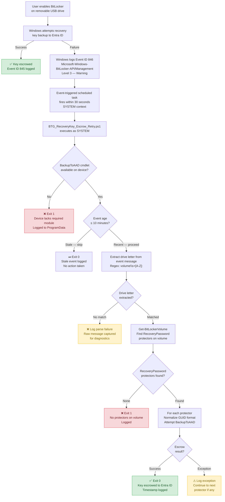

# BitLocker-to-Go Recovery Key Escrow (Hybrid Entra ID)

## Background

While backing up OS drive BitLocker recovery keys to Entra ID is
well supported today, BitLocker-to-Go recovery key escrow remains
a gray area when devices are **Hybrid Entra ID joined and Intune-managed**.

Although Group Policy and Intune CSPs exist to configure recovery
key backup behavior, Windows 10/11 does not natively and reliably
escrow **removable drive** recovery keys to Entra ID in this scenario.

This pattern documents a **design gap** identified during the
migration of an enterprise endpoint security control, and presents
a practical, event-driven workaround.

---

## Observed Platform Behavior

When a user enables BitLocker on a removable USB drive on a
Hybrid Entra ID joined device, Windows generates the following event:

- **Log:** Microsoft-Windows-BitLocker-API/Management  
- **Event ID:** 846  
- **Behavior:**  
  - Indicates failure to back up the BitLocker-to-Go recovery key
    to Entra ID
  - Includes the affected removable drive letter

This failure event becomes the **trigger point** for the solution.

---

## Solution Overview

The solution implements an **automated retry mechanism** that reacts
to the BitLocker API failure event and programmatically performs
recovery key escrow.

### High-Level Flow

> Color guide: green nodes = success paths, red = terminal failures, amber = logged errors with continuation.

---

## Technical Design

### 1. Event-Triggered Scheduled Task

An event-triggered scheduled task is created using the XML definition:

- `BitLockerToGo-Escrow-Retry.xml`

The task triggers immediately when **Event ID 846** is logged under
the BitLocker API management channel and launches a PowerShell script.

---

### 2. Recovery Key Escrow Script

The script:

- `BTG_RecoveryKey_Escrow_Retry.ps1`

Performs the following actions:

- Queries the BitLocker API event log for Event ID 846
- Extracts the removable drive letter from the event data
- Uses `Get-BitLockerVolume` to enumerate RecoveryPassword protectors on the volume
- Retries backing up the BitLocker-to-Go recovery key to Entra ID

This avoids reliance on end-user actions and compensates for the
initial escrow failure.

---

### 3. Installation & Registration Script

A helper script:

- `Install-BTGRecoveryKeyEscrow.ps1`

Handles deployment by:

- Copying the recovery script to a secure local path
- Registering the event-triggered scheduled task using the XML file
- Ensuring consistent behavior across Hybrid Entra ID devices

---

## Repository Contents

- `scripts/`  
  PowerShell scripts implementing detection, retry, and installation logic

- `tasks/`  
  XML definition for the event-triggered scheduled task

- `docs/`  
  Architecture diagrams and flow documentation

- `examples/`  
  Sanitized configuration samples and illustrative output

- `tests/`  
  Pester 5 unit tests for the escrow retry script

---

## Scope

This repository documents a design pattern for handling BitLocker-to-Go
recovery key escrow in Hybrid Entra ID environments where native behavior
is inconsistent.

The scripts are intentionally focused on illustrating control flow
and system behavior, not providing a turnkey deployment package.

---

## Disclaimer

This solution is provided as a reference implementation and design pattern.
It has been validated in a specific Hybrid Entra ID and Intune-managed
environment and may require adaptation for other configurations.

There is no guarantee that this approach will function identically
in all environments. Administrators should review, test, and validate
the behavior in a controlled setting before any production use.

Use at your own discretion.

---

## Key Takeaway

Endpoint security controls do not always fail loudly.
Sometimes, they fail *quietly* — and closing those gaps requires
understanding system behavior, not just configuring policies.

