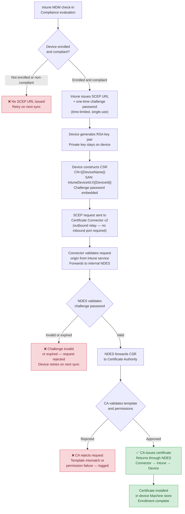

# SCEP Certificate Enrollment — Internal NDES (Hybrid Entra ID)

---
**Jump to section:**
[Strategic Overview](#strategic-overview) ·
[Architecture & Design](#architecture--design) ·
[Implementation Reference](#implementation-reference) ·
[Operational Guidance](#operational-guidance)

---

## Strategic Overview

### Who Should Read This

This document serves two audiences. Security architects and IT leadership
will find the strategic context, risk framing, and architectural
recommendation in this section. Engineers responsible for deploying and
operating the solution should proceed to
[Architecture & Design](#architecture--design) for design rationale,
[Implementation Reference](#implementation-reference) for deployment
steps, and [Operational Guidance](#operational-guidance) for monitoring
and failure handling.

---

### The Problem in Plain Terms

Intune delivers certificates to managed Windows devices using SCEP — the
Simple Certificate Enrollment Protocol. To issue those certificates from
an on-premises Certificate Authority, the CA-adjacent service that handles
enrollment requests, NDES (Network Device Enrollment Service), must be
reachable by the Intune cloud service. The path of least resistance in
most deployment guides is to expose NDES directly to the internet.

The consequence of that choice is an internet-facing endpoint that sits
one step from the organisation's certificate infrastructure. NDES does not
issue certificates itself, but it does broker requests to the CA. A
compromised or abused NDES service can be used to request certificates
against the organisation's PKI — potentially enabling fraudulent
authentication, lateral movement, or persistent access using certificates
that are trusted by the environment's own systems.

The failure mode is not hypothetical. NDES has a documented history of
vulnerabilities, and an internet-exposed instance provides an
unauthenticated attack surface against what should be one of the most
protected components of the environment. The risk is amplified in
organisations that rely on certificate-based authentication for Wi-Fi,
VPN, or device identity — where a certificate issued to an unauthorised
party grants real access.

---

### Risk and Compliance Implications

**Attack surface against certificate infrastructure**
An internet-exposed NDES server creates a CA-adjacent attack surface with
no dependency on corporate network access. Exploitation of the service —
whether through vulnerability, misconfiguration, or credential abuse —
can result in fraudulent certificate issuance against the organisation's
internal PKI. Certificates issued this way inherit the trust of the CA
and are not distinguishable from legitimately enrolled device certificates.

**Certificate-based authentication failure risk**
Many organisations rely on certificates for authentication to Wi-Fi
networks, VPN, and cloud services. The certificate infrastructure is
therefore a dependency of network access itself. Disruption or compromise
of NDES — whether through an attack or through operational failure — can
result in enrollment failures across the managed device population, with
downstream impact on connectivity and productivity.

**Zero Trust alignment**
A core principle of Zero Trust architecture is that only verified,
compliant, enrolled devices should be able to obtain credentials. An
internet-exposed NDES weakens this principle: the enrollment endpoint is
reachable by any internet host, and the strength of the control depends
entirely on the robustness of the challenge password mechanism. Routing
enrollment through the Intune Certificate Connector on an internal host
restores the boundary — only the connector, operating within the trusted
perimeter, communicates with NDES, and Intune enforces compliance posture
before any certificate is issued.

**Framework alignment**
NIST CSF Protect function (PR.AC) addresses access control and identity
management, including the requirement that only authorised devices and
users obtain credentials. NIST SP 800-207 (Zero Trust Architecture)
establishes the principle that access decisions should be made with full
context of device compliance and identity — a principle undermined when
certificate enrollment is available to any internet host. This document
does not constitute legal or compliance advice; organisations should
assess applicability to their specific obligations.

---

### Architectural Recommendation

Deploy NDES on an internal network segment with no inbound internet
connectivity. Route Intune certificate requests through the Microsoft
Intune Certificate Connector v2, installed on a domain-joined server
inside the perimeter. The connector establishes an outbound connection to
the Intune service, receives certificate requests on behalf of enrolled
devices, forwards them to the internal NDES server, and returns the
issued certificate — without requiring any inbound firewall rules or
internet-exposed endpoints.

This architecture eliminates the internet-facing attack surface against
the PKI entirely. Intune remains the policy enforcement and compliance
validation layer: no certificate request reaches NDES unless it
originates from an enrolled, compliant device that has satisfied Intune's
policy conditions. The CA itself remains on the internal network,
unreachable from the internet, with NDES equally protected.

---

## Architecture & Design

### Background

SCEP (Simple Certificate Enrollment Protocol) is the mechanism Intune
uses to deliver certificates from an on-premises Certificate Authority to
managed Windows devices. The enrollment chain involves three distinct
infrastructure components: the Intune cloud service, an NDES (Network
Device Enrollment Service) server that speaks SCEP, and the CA that
issues certificates against a defined template.

In the most common guidance-driven deployment, NDES is placed in a DMZ
or exposed directly to the internet so that the Intune cloud service can
reach it. This is a workable configuration technically, but it places a
CA-adjacent service on the internet attack surface — a position that
conflicts with standard PKI hardening practice and Zero Trust
architecture principles.

The Microsoft Intune Certificate Connector v2 provides an alternative:
an outbound-only relay installed on an internal, domain-joined server
that carries certificate requests between the Intune cloud service and
an internal NDES server. No inbound internet connectivity is required.
NDES remains fully inside the network perimeter.

---

### Solution Overview

The solution routes certificate enrollment through the Certificate
Connector v2, eliminating direct internet exposure of the NDES server
while preserving full Intune-managed SCEP enrollment functionality.

> Color guide: green nodes = success paths, red = terminal failure or rejection points.

---

### Component Overview

| Component | Location | Role |
|---|---|---|
| Intune Service | Microsoft cloud | Compliance gate, SCEP URL and challenge password issuance, certificate delivery |
| Managed Device | Endpoint | Key pair generation, CSR construction, certificate installation |
| Certificate Connector v2 | Internal network, domain-joined server | Outbound-only relay between Intune and NDES |
| NDES | Internal network | SCEP protocol handler, challenge password validation |
| Certificate Authority | Internal network | Template-based certificate issuance |

---

### Separation of Concerns

Each component in this architecture has a single, bounded responsibility.
Understanding where one component's role ends and another's begins is
important for both troubleshooting and for assessing the security posture
of the solution.

**Intune** owns compliance enforcement and policy. It decides which
devices are eligible to receive a certificate, issues the credential
(challenge password) that authorises a specific enrollment event, and
delivers the issued certificate to the device. Intune does not validate
the CSR itself — it passes the request through.

**Certificate Connector v2** owns the network boundary. Its sole
function is to relay requests from the Intune cloud service to the
internal NDES server and return responses. It validates that requests
originate from the Intune service, but it does not evaluate compliance or
validate the CSR content. It is the component that makes internal-only
NDES possible without a VPN or DMZ exposure.

**NDES** owns SCEP protocol handling and challenge password validation.
It verifies that each incoming request carries a valid, unused, unexpired
challenge password before forwarding the CSR to the CA. NDES does not
make compliance decisions — it trusts that the challenge password was
issued by Intune to an eligible device.

**The CA** owns certificate policy. It validates the CSR against the
configured template — key size, algorithm, permitted attributes — and
applies its own issuance controls independently of the SCEP layer. A
request that passes NDES validation can still be rejected by the CA if
it does not meet template requirements.

---

### Key Design Principles

| Principle | Description |
|---|---|
| **No inbound internet exposure** | The Certificate Connector v2 uses outbound-only connectivity; NDES receives no direct internet traffic |
| **Dual validation** | Every enrollment passes two independent checks: Intune compliance gate and NDES challenge password validation |
| **Private key stays on device** | The RSA key pair is generated on the endpoint; the private key is never transmitted |
| **Policy enforced at issuance** | The CA applies template constraints independently, providing a third validation layer |
| **Connector as single boundary component** | One internal server bridges cloud and PKI; the attack surface introduced is bounded and auditable |
| **No new CA infrastructure** | The solution uses the existing on-premises CA; no additional PKI components are required |

---

### Design Trade-offs and Alternatives Considered

**Why Certificate Connector v2 rather than the legacy connector?**
Microsoft deprecated the legacy Intune Certificate Connector. The v2
connector is the supported path and handles SCEP, PKCS, and PFX
certificate types from a single installation. It uses Entra ID app
registration for authentication rather than a service account, which
aligns with modern identity practices and removes a credential management
dependency. Organisations still running the legacy connector should plan
migration before it reaches end of support.

**Why not expose NDES in a DMZ with IP restriction?**
IP restriction on a DMZ-hosted NDES is a commonly proposed mitigation —
restricting inbound access to Microsoft's Intune service IP ranges. This
approach has two weaknesses: Microsoft's IP ranges for cloud services are
broad and change over time, making precise restriction difficult to
maintain; and a misconfiguration or IP range expansion can silently
re-open the attack surface. The connector model eliminates the inbound
exposure entirely rather than managing it through perimeter rules.

**Why not use PKCS certificates instead of SCEP?**
PKCS certificate delivery via Intune generates the key pair on the server
side, which means the private key is transmitted to the device. For
device authentication certificates this is a weaker security posture than
SCEP, where the private key is generated on-device and never transmitted.
SCEP with an internal NDES is the appropriate model for device identity
certificates.

**Why not cloud-only PKI (Microsoft Cloud PKI)?**
Microsoft Cloud PKI is a viable path for organisations moving to fully
cloud-managed endpoints with no dependency on on-premises infrastructure.
For organisations with an existing on-premises CA, established certificate
templates, and hybrid infrastructure, the internal NDES pattern preserves
the existing PKI investment and avoids a CA migration. The choice between
them is an infrastructure strategy decision, not a security one — both
models can achieve equivalent security posture.

---
