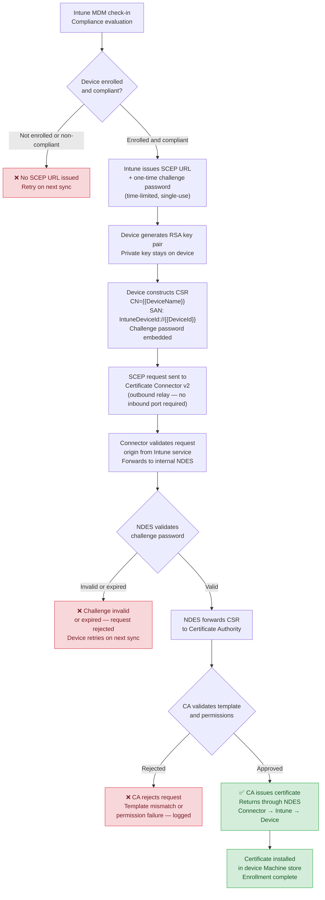

# SCEP Certificate Enrollment — Internal NDES (Hybrid Entra ID)

---
**Jump to section:**
[Strategic Overview](#strategic-overview) ·
[Architecture & Design](#architecture--design) ·
[Implementation Reference](#implementation-reference) ·
[Operational Guidance](#operational-guidance)

---

## Strategic Overview

### Who Should Read This

This document serves two audiences. Security architects and IT leadership
will find the strategic context, risk framing, and architectural
recommendation in this section. Engineers responsible for deploying and
operating the solution should proceed to
[Architecture & Design](#architecture--design) for design rationale,
[Implementation Reference](#implementation-reference) for deployment
steps, and [Operational Guidance](#operational-guidance) for monitoring
and failure handling.

---

### The Problem in Plain Terms

Intune delivers certificates to managed Windows devices using SCEP — the
Simple Certificate Enrollment Protocol. To issue those certificates from
an on-premises Certificate Authority, the CA-adjacent service that handles
enrollment requests, NDES (Network Device Enrollment Service), must be
reachable by the Intune cloud service. The path of least resistance in
most deployment guides is to expose NDES directly to the internet.

The consequence of that choice is an internet-facing endpoint that sits
one step from the organisation's certificate infrastructure. NDES does not
issue certificates itself, but it does broker requests to the CA. A
compromised or abused NDES service can be used to request certificates
against the organisation's PKI — potentially enabling fraudulent
authentication, lateral movement, or persistent access using certificates
that are trusted by the environment's own systems.

The failure mode is not hypothetical. NDES has a documented history of
vulnerabilities, and an internet-exposed instance provides an
unauthenticated attack surface against what should be one of the most
protected components of the environment. The risk is amplified in
organisations that rely on certificate-based authentication for Wi-Fi,
VPN, or device identity — where a certificate issued to an unauthorised
party grants real access.

---

### Risk and Compliance Implications

**Attack surface against certificate infrastructure**
An internet-exposed NDES server creates a CA-adjacent attack surface with
no dependency on corporate network access. Exploitation of the service —
whether through vulnerability, misconfiguration, or credential abuse —
can result in fraudulent certificate issuance against the organisation's
internal PKI. Certificates issued this way inherit the trust of the CA
and are not distinguishable from legitimately enrolled device certificates.

**Certificate-based authentication failure risk**
Many organisations rely on certificates for authentication to Wi-Fi
networks, VPN, and cloud services. The certificate infrastructure is
therefore a dependency of network access itself. Disruption or compromise
of NDES — whether through an attack or through operational failure — can
result in enrollment failures across the managed device population, with
downstream impact on connectivity and productivity.

**Zero Trust alignment**
A core principle of Zero Trust architecture is that only verified,
compliant, enrolled devices should be able to obtain credentials. An
internet-exposed NDES weakens this principle: the enrollment endpoint is
reachable by any internet host, and the strength of the control depends
entirely on the robustness of the challenge password mechanism. Routing
enrollment through the Intune Certificate Connector on an internal host
restores the boundary — only the connector, operating within the trusted
perimeter, communicates with NDES, and Intune enforces compliance posture
before any certificate is issued.

**Framework alignment**
NIST CSF Protect function (PR.AC) addresses access control and identity
management, including the requirement that only authorised devices and
users obtain credentials. NIST SP 800-207 (Zero Trust Architecture)
establishes the principle that access decisions should be made with full
context of device compliance and identity — a principle undermined when
certificate enrollment is available to any internet host. This document
does not constitute legal or compliance advice; organisations should
assess applicability to their specific obligations.

---

### Architectural Recommendation

Deploy NDES on an internal network segment with no inbound internet
connectivity. Route Intune certificate requests through the Microsoft
Intune Certificate Connector v2, installed on a domain-joined server
inside the perimeter. The connector establishes an outbound connection to
the Intune service, receives certificate requests on behalf of enrolled
devices, forwards them to the internal NDES server, and returns the
issued certificate — without requiring any inbound firewall rules or
internet-exposed endpoints.

This architecture eliminates the internet-facing attack surface against
the PKI entirely. Intune remains the policy enforcement and compliance
validation layer: no certificate request reaches NDES unless it
originates from an enrolled, compliant device that has satisfied Intune's
policy conditions. The CA itself remains on the internal network,
unreachable from the internet, with NDES equally protected.

---

## Architecture & Design

### Background

SCEP (Simple Certificate Enrollment Protocol) is the mechanism Intune
uses to deliver certificates from an on-premises Certificate Authority to
managed Windows devices. The enrollment chain involves three distinct
infrastructure components: the Intune cloud service, an NDES (Network
Device Enrollment Service) server that speaks SCEP, and the CA that
issues certificates against a defined template.

In the most common guidance-driven deployment, NDES is placed in a DMZ
or exposed directly to the internet so that the Intune cloud service can
reach it. This is a workable configuration technically, but it places a
CA-adjacent service on the internet attack surface — a position that
conflicts with standard PKI hardening practice and Zero Trust
architecture principles.

The Microsoft Intune Certificate Connector v2 provides an alternative:
an outbound-only relay installed on an internal, domain-joined server
that carries certificate requests between the Intune cloud service and
an internal NDES server. No inbound internet connectivity is required.
NDES remains fully inside the network perimeter.

---

### Solution Overview

The solution routes certificate enrollment through the Certificate
Connector v2, eliminating direct internet exposure of the NDES server
while preserving full Intune-managed SCEP enrollment functionality.



> Color guide: green nodes = success paths, red = terminal failure or rejection points.

---

### Component Overview

| Component | Location | Role |
|---|---|---|
| Intune Service | Microsoft cloud | Compliance gate, SCEP URL and challenge password issuance, certificate delivery |
| Managed Device | Endpoint | Key pair generation, CSR construction, certificate installation |
| Certificate Connector v2 | Internal network, domain-joined server | Outbound-only relay between Intune and NDES |
| NDES | Internal network | SCEP protocol handler, challenge password validation |
| Certificate Authority | Internal network | Template-based certificate issuance |

---

### Separation of Concerns

Each component in this architecture has a single, bounded responsibility.
Understanding where one component's role ends and another's begins is
important for both troubleshooting and for assessing the security posture
of the solution.

**Intune** owns compliance enforcement and policy. It decides which
devices are eligible to receive a certificate, issues the credential
(challenge password) that authorises a specific enrollment event, and
delivers the issued certificate to the device. Intune does not validate
the CSR itself — it passes the request through.

**Certificate Connector v2** owns the network boundary. Its sole
function is to relay requests from the Intune cloud service to the
internal NDES server and return responses. It validates that requests
originate from the Intune service, but it does not evaluate compliance or
validate the CSR content. It is the component that makes internal-only
NDES possible without a VPN or DMZ exposure.

**NDES** owns SCEP protocol handling and challenge password validation.
It verifies that each incoming request carries a valid, unused, unexpired
challenge password before forwarding the CSR to the CA. NDES does not
make compliance decisions — it trusts that the challenge password was
issued by Intune to an eligible device.

**The CA** owns certificate policy. It validates the CSR against the
configured template — key size, algorithm, permitted attributes — and
applies its own issuance controls independently of the SCEP layer. A
request that passes NDES validation can still be rejected by the CA if
it does not meet template requirements.

---

### Key Design Principles

| Principle | Description |
|---|---|
| **No inbound internet exposure** | The Certificate Connector v2 uses outbound-only connectivity; NDES receives no direct internet traffic |
| **Dual validation** | Every enrollment passes two independent checks: Intune compliance gate and NDES challenge password validation |
| **Private key stays on device** | The RSA key pair is generated on the endpoint; the private key is never transmitted |
| **Policy enforced at issuance** | The CA applies template constraints independently, providing a third validation layer |
| **Connector as single boundary component** | One internal server bridges cloud and PKI; the attack surface introduced is bounded and auditable |
| **No new CA infrastructure** | The solution uses the existing on-premises CA; no additional PKI components are required |

---

### Design Trade-offs and Alternatives Considered

**Why Certificate Connector v2 rather than the legacy connector?**
Microsoft deprecated the legacy Intune Certificate Connector. The v2
connector is the supported path and handles SCEP, PKCS, and PFX
certificate types from a single installation. It uses Entra ID app
registration for authentication rather than a service account, which
aligns with modern identity practices and removes a credential management
dependency. Organisations still running the legacy connector should plan
migration before it reaches end of support.

**Why not expose NDES in a DMZ with IP restriction?**
IP restriction on a DMZ-hosted NDES is a commonly proposed mitigation —
restricting inbound access to Microsoft's Intune service IP ranges. This
approach has two weaknesses: Microsoft's IP ranges for cloud services are
broad and change over time, making precise restriction difficult to
maintain; and a misconfiguration or IP range expansion can silently
re-open the attack surface. The connector model eliminates the inbound
exposure entirely rather than managing it through perimeter rules.

**Why not use PKCS certificates instead of SCEP?**
PKCS certificate delivery via Intune generates the key pair on the server
side, which means the private key is transmitted to the device. For
device authentication certificates this is a weaker security posture than
SCEP, where the private key is generated on-device and never transmitted.
SCEP with an internal NDES is the appropriate model for device identity
certificates.

**Why not cloud-only PKI (Microsoft Cloud PKI)?**
Microsoft Cloud PKI is a viable path for organisations moving to fully
cloud-managed endpoints with no dependency on on-premises infrastructure.
For organisations with an existing on-premises CA, established certificate
templates, and hybrid infrastructure, the internal NDES pattern preserves
the existing PKI investment and avoids a CA migration. The choice between
them is an infrastructure strategy decision, not a security one — both
models can achieve equivalent security posture.

---

## Implementation Reference

### Environment Requirements

| Requirement | Detail |
|---|---|
| **NDES server OS** | Windows Server 2016, 2019, or 2022 |
| **CA** | Active Directory Certificate Services (Enterprise CA); Standalone CA not supported for Intune SCEP |
| **Certificate Connector v2 OS** | Windows Server 2016, 2019, or 2022; domain-joined |
| **Certificate Connector v2 .NET** | .NET Framework 4.7.2 or later |
| **Intune subscription** | Microsoft Intune Plan 1 or equivalent |
| **Device management** | Hybrid Entra ID joined; Intune-managed |
| **Network — connector outbound** | HTTPS (443) to Intune service endpoints; no inbound rules required |
| **Network — connector to NDES** | HTTPS or HTTP from connector server to NDES; internal network only |
| **NDES service account** | Domain account; IIS_IUSRS member; enrollment agent certificate |

---

### NDES Prerequisites

Before installing the Certificate Connector v2, NDES must be deployed and
functional on an internal server.

**Service account**
NDES requires a dedicated domain service account with:
- Local logon rights on the NDES server
- Enroll permission on the NDES enrollment agent certificate template
- Read and Enroll permission on the device certificate template

**Certificate templates**
Three templates must be configured on the CA:

1. **CEP Encryption** — used by NDES to encrypt challenge passwords
2. **Exchange Enrollment Agent (Offline Request)** — used by NDES to sign
   requests on behalf of devices
3. **Device certificate template** — the template for issued device
   certificates; key usage, EKU, and subject constraints must match the
   Intune SCEP profile exactly

**IIS configuration**
NDES installs as an IIS web application. The NDES URL must be reachable
from the Certificate Connector v2 server over the internal network.
Confirm IIS is running and the NDES application pool is started before
proceeding to connector installation.

---

### Certificate Connector v2 — Installation

The Certificate Connector v2 installer is available from the Intune admin
center under **Tenant administration → Connectors and tokens →
Certificate connectors**.

> **Note on the legacy connector:** Microsoft has deprecated the original
> Intune Certificate Connector. If the legacy connector is currently
> installed in the environment, it must be migrated — the two connectors
> cannot coexist on the same server. The legacy connector is no longer
> receiving feature updates and will reach end of support. Treat migration
> as a priority for any environment still running it.

**Installation steps:**

1. Download the connector installer from the Intune admin center
2. Run the installer on the domain-joined connector server with local
   administrator rights
3. During setup, authenticate with an account holding the **Intune
   Administrator** or **Cloud Device Administrator** Entra ID role —
   this creates the Entra ID app registration the connector uses for
   authentication
4. Configure the connector to point to the internal NDES URL
5. Verify the connector service (`Microsoft Intune Certificate Connector`)
   is running

The connector authenticates to Intune via the Entra ID app registration
created at install time. No service account password management is
required.

---

### SCEP Profile Configuration

Configure the SCEP profile in the Intune admin center under **Devices →
Configuration → Create → Windows 10 and later → Templates → SCEP
certificate**.

Key profile settings with annotations are documented in
[`examples/scep-profile-sample.md`](examples/scep-profile-sample.md).

The following settings must align exactly with the CA certificate
template:

| Profile setting | Must match |
|---|---|
| Key size | Template minimum key size |
| Hash algorithm | Template signature hash algorithm |
| Certificate validity period | Template validity period (or less) |
| Extended key usage | Template EKU configuration |
| Subject name format | Template subject name constraints |

Mismatches between the SCEP profile and the CA template are a common
cause of issuance failure. The CA rejects the request at Step 6 of the
enrollment flow and logs the denial reason — see
[Operational Guidance → Failure Detection](#failure-detection).

---

### Validation

**1. Verify connector status**

In the Intune admin center, navigate to **Tenant administration →
Connectors and tokens → Certificate connectors**. The connector should
show status **Active**. A status of **Error** or **Inactive** indicates
a connectivity or authentication issue.

**2. Confirm NDES is reachable from the connector server**

From the connector server, browse to the NDES URL:

```
https://<ndes-server>/certsrv/mscep/mscep.dll
```

A `400 Bad Request` response or a certificate challenge prompt indicates
NDES is running. A connection failure indicates a network or IIS issue.

**3. Trigger a test enrollment**

Assign the SCEP profile to a test device and force an Intune sync:

```powershell
Start-Process -FilePath "C:\Windows\System32\deviceenroller.exe" -ArgumentList "/o"
```

After the sync, check the device certificate store:

```powershell
Get-ChildItem -Path Cert:\LocalMachine\My |
    Where-Object { $_.Subject -like "*DeviceName*" } |
    Select-Object Subject, NotBefore, NotAfter, Thumbprint
```

**4. Verify issuance in the CA**

On the CA server, open the Certification Authority console and check
**Issued Certificates** for a recently issued certificate matching the
device name. If the request was rejected, check **Failed Requests** for
the denial reason.

**5. Review connector logs**

The Certificate Connector v2 writes logs to:

```
%ProgramFiles%\Microsoft Intune\PFXCertificateConnector\ConnectorLog\
```

Each enrollment attempt is logged with a request ID, timestamp, and
outcome. Cross-reference the request ID with the Intune device enrollment
report for end-to-end visibility.

---

## Operational Guidance

### Monitoring After Deployment

**Connector health**
The Certificate Connector v2 reports its status to the Intune admin
center under **Tenant administration → Connectors and tokens →
Certificate connectors**. An **Active** status confirms the connector is
communicating with Intune. An **Error** or **Inactive** status requires
immediate investigation — no certificate enrollment will succeed while
the connector is unhealthy.

The connector writes detailed operational logs to:

```
%ProgramFiles%\Microsoft Intune\PFXCertificateConnector\ConnectorLog\
```

Review these logs when investigating enrollment failures or after
connector updates.

**CA issuance events**
The CA provides the authoritative record of all certificate activity.
Monitor for:
- **Issued Certificates** — volume and device names; unexpected drops
  indicate enrollment issues
- **Failed Requests** — any entry here represents a request the CA
  rejected; the denial reason is logged and should be reviewed promptly
- **CRL validity** — if the CRL published by the CA expires, devices may
  reject the CA's certificates during authentication

**Intune device enrollment reports**
In the Intune admin center, the SCEP profile deployment status shows
per-device success or failure. A profile showing **Failed** for a device
means enrollment did not complete. The error code in the report maps to
a point in the enrollment flow — see Failure Detection below.

---

### Certificate Renewal

SCEP certificates are renewed automatically when the device reaches the
renewal threshold configured in the SCEP profile (recommended: 20% of
certificate lifetime remaining). Renewal follows the same flow as initial
enrollment — the device must be enrolled, compliant, and able to reach
Intune.

**Connectivity dependency**
Renewal requires the device to complete an Intune MDM sync while
connected to the internet. Devices that are offline for extended periods
may miss the renewal window. If a device goes offline before the renewal
threshold is reached and the certificate expires while offline, the device
must reconnect and trigger a manual sync to re-enroll from scratch.

**CRL and OCSP availability**
Devices validate the CA chain when using issued certificates for
authentication. The CA's CRL distribution points and OCSP responder must
be reachable from managed devices. For devices that authenticate to Wi-Fi
or VPN using a device certificate, CRL unavailability can block the
authentication the device needs to reach the network — creating a
circular dependency. Confirm CRL distribution points are accessible from
devices before authentication dependencies are established.

---

### Coordination with PKI Team

This solution introduces a dependency between Intune operations and the
on-premises PKI. Changes on either side can affect the other. Establish
a coordination process for the following change types:

| Change type | Action required |
|---|---|
| CA certificate template change | Update Intune SCEP profile in the same change window |
| CA renewal or replacement | Update trusted root and intermediate profiles in Intune; update connector if CA FQDN changes |
| NDES server change or migration | Update connector configuration; validate end-to-end enrollment before decommissioning old NDES |
| Certificate Connector v2 update | Review release notes for breaking changes; validate connector status post-update |
| CRL or OCSP URL change | Update CA template CDP extensions; allow time for existing certificates to reflect new URLs before old URLs are decommissioned |

---

### Failure Detection

**Symptom: SCEP profile shows Failed in Intune for a device**

Check the error code in the Intune device configuration report:

| Error | Likely cause | Resolution |
|---|---|---|
| 0x87D1FDE8 | Device could not reach the SCEP URL | Verify connector is Active; check device internet connectivity |
| 0x80094800 | Challenge password invalid or expired | Retry sync — Intune will issue a fresh challenge password |
| 0x80094801 | Challenge password already used | Retry sync — one-time passwords cannot be reused |
| CA denial (various) | Template mismatch, permissions, or key constraints | Check Failed Requests on CA; compare template and SCEP profile settings |

**Symptom: Connector shows Error or Inactive in Intune**

```powershell
Get-Service -Name "Microsoft Intune Certificate Connector" |
    Select-Object Name, Status, StartType
```

If the service is stopped, start it and check the connector logs for the
failure reason. Common causes: Entra ID app registration token expired
(re-authenticate by re-running connector setup), network change blocking
outbound HTTPS to Intune endpoints, or a connector update requiring
manual intervention.

**Symptom: Certificate installed on device but authentication fails**

If the certificate is present in the device store but authentication to
Wi-Fi or VPN fails, check:
- Certificate EKU matches what the authentication server requires
  (Client Authentication OID: 1.3.6.1.5.5.7.3.2)
- CA chain is trusted on the authenticating server (RADIUS/NPS)
- CRL is reachable and not expired
- Certificate subject or SAN matches the identity expected by the
  authentication policy

**Symptom: Renewal fails for a subset of devices**

Devices that fail renewal while compliant are typically
connectivity-related. Check:
- Last Intune sync time — devices that have not synced recently will not
  have received the renewal trigger
- Whether affected devices are on a network that blocks Intune endpoints
- Whether devices are at or past certificate expiry — expired certificates
  cannot be renewed; the device must re-enroll via a forced sync

---

### Dependencies

| Dependency | Notes |
|---|---|
| Certificate Connector v2 | Must be Active; single point of failure unless multiple connector instances are deployed for high availability |
| NDES service availability | NDES downtime blocks all enrollment and renewal; monitor IIS and application pool health |
| CA availability | CA downtime blocks issuance; CRL expiry can independently block authentication |
| Intune MDM connectivity | Devices must reach Intune to receive SCEP URLs and challenge passwords |
| CRL/OCSP reachability from devices | Required for certificate validation during authentication; failure creates circular dependency in network-auth scenarios |
| PKI team change coordination | Template or CA changes without Intune profile alignment will cause enrollment failures |

---

## Disclaimer

This solution is provided as a reference implementation and design
pattern. It has been developed against specific Hybrid Entra ID and
Intune-managed environment configurations and may require adaptation
for other environments.

There is no guarantee that this approach will function identically in
all environments. Administrators should review, test, and validate
behaviour in a controlled setting before any production use.

Use at your own discretion.
