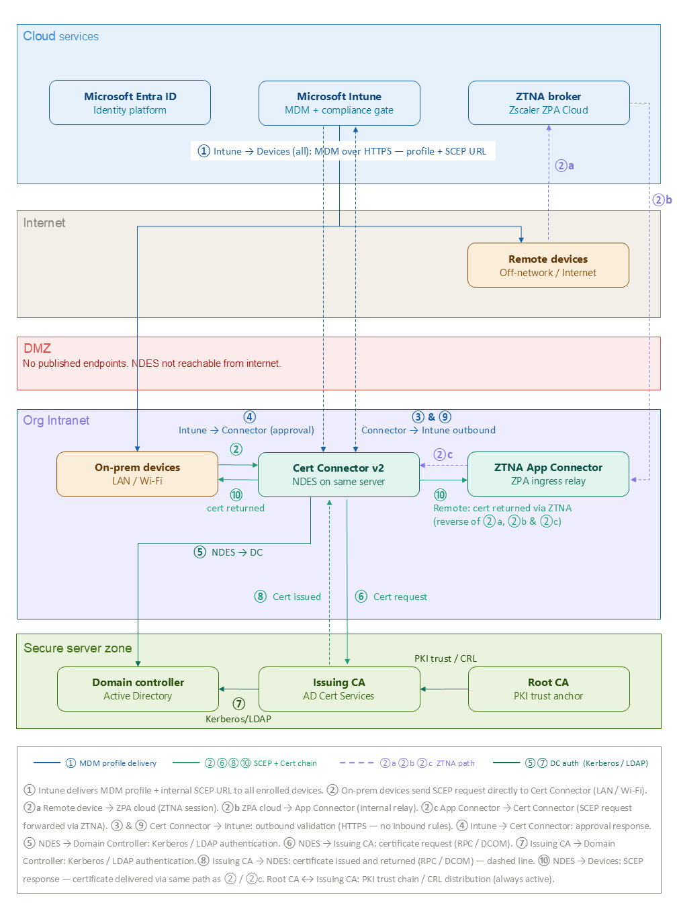

# Architecture Flow: SCEP Certificate Enrollment Internal NDES

## Overview

This document provides a step-by-step walkthrough of the SCEP certificate
enrollment flow for Intune-managed Windows devices using an internal NDES
server and the Microsoft Intune Certificate Connector v2. It is intended
for engineers who need to understand what happens at each stage,
including validation decisions, failure paths, and the rationale for each
component's position in the architecture.

---

## Component Map

| Component | Location | Role |
|---|---|---|
| Microsoft Entra ID | Microsoft cloud | Device identity and join/registration; prerequisite for Intune enrollment |
| Intune Service | Microsoft cloud | Policy enforcement, compliance validation, SCEP URL and challenge issuance |
| ZTNA broker | Cloud (e.g. Zscaler ZPA) | Brokers a session for remote devices into the internal network, scoped to one application |
| Managed Device | Endpoint (on-prem or remote) | Key pair generation, CSR construction, certificate installation |
| App Connector | Internal network | Pairs with the ZTNA broker; relays remote SCEP traffic to the Certificate Connector |
| Certificate Connector v2 | Internal network, domain-joined server | Outbound-only relay between Intune and NDES |
| NDES | Internal network (same server as the Connector in this pattern) | SCEP protocol handler, challenge password validation |
| Domain Controller | Internal network | Kerberos/LDAP authentication for NDES and the Issuing CA |
| Issuing CA | Internal network | Certificate issuance against policy template |
| Root CA | Internal network | PKI trust anchor; signs the Issuing CA, publishes CRL |

---

## Two Gates, Not One

Before walking through the steps, it is worth being precise about what
actually stops an unauthorised enrollment, because it is not a single
control. Two independent gates must both hold:

**Gate 1 — Policy.** Intune will not issue a SCEP profile, and therefore
will not hand out the SCEP URL or a challenge password, to a device that
is not enrolled and compliant. This is the gate most documentation
focuses on.

**Gate 2 — Network.** The SCEP URL itself is an **internal DNS alias**
(a CNAME pointing at the Certificate Connector). That name is only
registered in the organisation's internal DNS zone; it does not exist in
public DNS. Even if a SCEP URL leaked outside the policy gate, an
internet host could not resolve it. This is the gate that makes the
internet-exposed-NDES pattern unnecessary in the first place: there is
nothing for an external host to find, because the DMZ in this
architecture is deliberately empty.

Both gates have to pass for an enrollment to proceed. A failure of either
one stops the flow before a certificate request is ever evaluated.

---

## Enrollment Flow: Step by Step

### Step 1 (①): Device Check-in and Compliance Evaluation

The enrollment flow begins when the managed device checks in with Intune,
either on a scheduled MDM sync cycle, on device startup, or when a policy
change is pushed. The device must already be Entra ID joined or
registered; Intune evaluates the device against the applicable compliance
policies:

- Is the device enrolled?
- Is it within the compliance policy scope?
- Does it satisfy any compliance requirements that gate certificate
  delivery?

If the device is not enrolled or is non-compliant, the flow stops here.
No SCEP URL is issued and no certificate request is initiated. This is
Gate 1: certificate enrollment is gated on Intune-verified compliance,
not on network access to the enrollment endpoint.

### Step 2 (① continued): SCEP URL and Challenge Password Issuance

For a compliant device, Intune issues:

- The SCEP URL pointing to the Certificate Connector v2, as an internal
  DNS alias (Gate 2 — see above)
- A one-time challenge password (OTP) with a short validity window

The challenge password is generated by the Intune service and delivered
to the device over the existing encrypted MDM channel. It is single-use
and time-limited, typically valid for minutes. Its purpose is to bind
the subsequent SCEP request to a specific Intune-authorised enrollment
event. A SCEP request that arrives at NDES without a valid challenge
password is rejected unconditionally.

### Step 3: Key Pair and CSR Generation on Device

The device generates an RSA key pair in the device key store. The private
key is generated on-device and does not leave the device at any point in
the flow. The device constructs a Certificate Signing Request (CSR)
encoding:

- The requested subject name (CN=DeviceName or as configured in the SCEP
  profile)
- The Subject Alternative Name (Intune Device ID URI)
- The public key
- The challenge password, embedded in the SCEP pkiMessage

### Step 4 (② / ②a–②c): Reaching the Certificate Connector

How the CSR reaches the Connector depends on where the device is.

**On-prem device (②):** The device is on the corporate LAN or Wi-Fi, so
the internal DNS alias resolves directly. The device sends the SCEP
request straight to the Certificate Connector.

**Remote device (②a → ②b → ②c):** The device is off-network and cannot
resolve the internal alias at all. Instead:

- **②a** — The device establishes a ZTNA session with the broker (for
  example, Zscaler ZPA cloud).
- **②b** — The broker relays the session internally to the paired App
  Connector running inside the organisation's network.
- **②c** — The App Connector forwards the SCEP request to the
  Certificate Connector over the internal network.

At no point does the remote device get an IP address on the internal
network or the ability to browse it; the ZTNA session is scoped to this
one endpoint. See [README.md → A Note on ZTNA](../README.md#a-note-on-ztna)
for more detail on the broker model.

### Step 5 (③ & ⑨ / ④): Certificate Connector Validates with Intune

The Certificate Connector v2 does not trust an inbound SCEP request on
its own. It:

- Runs on a domain-joined server inside the corporate network perimeter
- Maintains an **outbound-only** HTTPS connection to the Intune service;
  no inbound firewall rule is required for this flow
- Sends the request details to Intune for validation (③ & ⑨)
- Receives an approval response from Intune (④) before proceeding

This is what eliminates the need for internet-exposed NDES: the
Connector reaches out to Intune, Intune never needs to reach in.

**Connector v2 vs. legacy connector:** Microsoft deprecated the legacy
Intune Certificate Connector. The v2 connector is the supported path and
handles SCEP, PKCS, and PFX certificate types from a single installation.
It uses Entra ID app registration for authentication rather than a
service account, which removes a credential management dependency.
Organisations still running the legacy connector should plan migration
before it reaches end of support.

### Step 6 (⑤): NDES Authenticates to the Domain Controller

Once validated, the request is handed to NDES (running on the same
server as the Connector in this pattern). Before NDES can act on behalf
of a device, it authenticates to the Domain Controller over
Kerberos/LDAP to confirm its own service account permissions. This is a
separate authentication event from the device's own identity check in
Step 1; it establishes that NDES itself is a trusted, domain-joined
service entitled to broker certificate requests.

### Step 7: NDES Challenge Password Validation

NDES validates the embedded challenge password:

- The password must match one issued by Intune within its validity window
- The password must not have been used before (single-use enforcement)
- The request must conform to the certificate template constraints
  configured on NDES

If any of these validations fail, NDES returns a SCEP error response and
the request is rejected. The device retries on the next MDM sync cycle,
at which point Intune issues a fresh challenge password.

### Step 8 (⑥): Certificate Request to the Issuing CA

NDES forwards the validated CSR to the Issuing CA over RPC/DCOM.

### Step 9 (⑦): Issuing CA Authenticates to the Domain Controller

Before issuing, the Issuing CA performs its own Kerberos/LDAP
authentication against the Domain Controller, independently of NDES's
authentication in Step 6. The CA then applies its policy layer:

- Does the request match the permitted template?
- Does the CSR conform to the template's key and algorithm requirements?
- Does the NDES service account hold enroll permission on the template?

If all checks pass, the CA issues the certificate. Common rejections
include key size below template minimum, requested attributes not
permitted by the template, or insufficient permissions on the template.

The Issuing CA's own certificate chains to the Root CA, which is the
PKI trust anchor and CRL publisher for the environment (shown as a
constant bidirectional relationship in the diagram, not a per-enrollment
flow step).

### Step 10 (⑧): Certificate Returned to NDES

The Issuing CA returns the signed certificate to NDES over RPC/DCOM.

### Step 11 (⑩): Certificate Delivered to the Device

The certificate travels back through the same path the request came in
on, reversed: NDES → Certificate Connector → device directly (on-prem)
or NDES → Certificate Connector → App Connector → ZTNA broker → device
(remote). The device installs the certificate into the Machine store.
The private key, which never left the device, is now paired with the
issued certificate. Intune records the enrollment result and will
reattempt delivery on the next sync cycle if any step in the return path
fails.

---

## Failure Paths and Rejection Handling

| Failure point | Cause | Outcome |
|---|---|---|
| Step 1: Compliance check fails (Gate 1) | Device not enrolled or non-compliant | No SCEP URL issued; retry after compliance is restored |
| Step 2: Challenge password delivery fails | MDM channel disruption | Device retries on next sync cycle |
| Step 4: Internal DNS alias does not resolve (Gate 2) | Device off-network with no ZTNA/VPN path | Request never reaches the Connector; not a rejection, a non-event |
| Step 4: ZTNA session fails | Broker or App Connector unavailable | Remote device cannot reach the Connector; check broker and App Connector health |
| Step 5: Connector cannot validate with Intune | Outbound connectivity or Entra ID app registration issue | Connector logs error; request not forwarded to NDES |
| Step 6: NDES cannot authenticate to DC | Kerberos/LDAP failure, account lockout, DC unavailable | NDES cannot process any request until resolved |
| Step 7: Challenge password invalid or expired | Password timeout or reuse attempt | NDES rejects; Intune issues fresh password on next attempt |
| Step 7: Template constraint violation | CSR does not match NDES template | NDES rejects; requires profile or template correction |
| Step 9: Issuing CA cannot authenticate to DC | Kerberos/LDAP failure, CA service account issue | CA cannot issue until resolved |
| Step 9: CA denies request | Template permissions, key size, or algorithm mismatch | CA logs denial; requires CA or template configuration review |

---

## Security Posture Summary

The internal NDES architecture enforces independent validation at
several points before a certificate is issued:

1. **Policy gate (Intune compliance)**: enrollment begins only for
   compliant, enrolled devices
2. **Network gate (internal DNS alias)**: the SCEP URL is unreachable
   and unresolvable from outside the organisation's network or ZTNA path
3. **NDES challenge password**: each request must carry a valid
   single-use OTP tied to an Intune-authorised event
4. **Domain Controller authentication**: both NDES and the Issuing CA
   independently authenticate before acting, ensuring only trusted,
   domain-joined services participate in the chain
5. **CA template policy**: issuance is independently constrained by the
   certificate template regardless of what passed earlier in the chain

No single control failure authorises issuance. An attacker would need to
defeat the policy gate, the network gate, the challenge password, and
the CA's own template policy simultaneously, an unlikely combination by
design.
