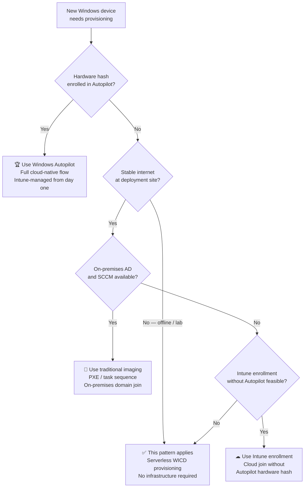

# Serverless Windows Provisioning with WICD

---
**Jump to section:**
[Strategic Overview](#strategic-overview) ·
[Architecture & Design](#architecture--design) ·
[Implementation Reference](#implementation-reference) ·
[Operational Guidance](#operational-guidance)

---

## Strategic Overview

### Who Should Read This

This document serves two audiences. Security architects and IT leadership
will find the strategic context, risk framing, and architectural
recommendation in this section. Engineers responsible for deploying and
operating the solution should proceed to
[Architecture & Design](#architecture--design) for design rationale,
[Implementation Reference](#implementation-reference) for deployment
steps, and [Operational Guidance](#operational-guidance) for monitoring
and failure handling.

---

### The Problem in Plain Terms

Not every organisation can adopt cloud-native provisioning immediately.
SMB environments, regulated environments with network restrictions,
offline deployment scenarios, and organisations in transitional states
all need a secure provisioning path that does not depend on deployment
infrastructure, cloud connectivity, or pre-registered hardware hashes.

When no lightweight official path exists, the practical outcome is
inconsistent provisioning — devices set up manually, with varying
security baselines, by whoever is available. The risk is not that the
wrong tool is used; it is that no governed process exists at all.

---

### Risk and Compliance Implications

**Security baseline gaps**
Unprovisioned or inconsistently provisioned devices enter the estate
without verified encryption, policy application, or configuration
baselines. Each manually provisioned device is a potential gap that may
not be detected until an audit or incident surfaces it.

**Autopilot dependency as a single point of failure**
Environments that have consolidated onto Autopilot without a fallback
provisioning path face a gap when devices cannot be pre-registered,
when cloud connectivity is unavailable at the deployment site, or when
the Autopilot service is degraded. Without an alternative, devices
either go unprovisioned or are set up outside any governed process.

**Shadow IT provisioning**
When no official lightweight provisioning path exists, teams find their
own. USB-based re-imaging, manual setup, or community scripts fill the
gap — without the security controls, audit trail, or change management
that a governed provisioning approach provides.

---

### Architectural Recommendation

Native Windows tooling — specifically the Windows Imaging and
Configuration Designer (WICD) and provisioning packages — provides a
viable, secure provisioning path without infrastructure dependency for
environments where Autopilot or SCCM are not feasible. The approach
applies encryption, security configuration, and identity join during
OOBE using only platform-native mechanisms, with no deployment servers,
imaging pipelines, or long-running agents.

---

## Architecture & Design

### Background

Provisioning Windows devices is often framed as a binary choice:

1. Traditional imaging infrastructure (servers, AD, SCCM)
2. Fully cloud-native provisioning (Autopilot, Intune)

In reality, many environments sit in between, or intentionally avoid
adding infrastructure. Conventional provisioning assumes deployment
servers, directory services, and persistent management infrastructure —
none of which may exist in these scenarios.

This pattern demonstrates how to provision devices securely and
consistently using only the platform's native capabilities, without
deployment servers, imaging pipelines, or long-running agents.

---

### When to Use This Pattern



> For fully cloud-managed deployments (Entra ID + Intune), Autopilot
> remains the preferred approach. WICD provides value for offline or
> constrained setups, or when bulk provisioning without backend services
> is required.

---

### How It Works

1. A provisioning package (`.ppkg`) defines system configuration,
   security settings, and application installs
2. Devices boot from prepared installation media (USB)
3. Users complete Entra ID join during setup
4. Security controls — BitLocker, VPN, Wi-Fi, compliance settings —
   are applied automatically
5. Device reaches a compliant and usable state without manual
   intervention

> No deployment servers · No imaging pipelines · No long-running agents

---

### Security Design Principles

| Principle | Description |
|---|---|
| **Encryption at provisioning** | BitLocker is enabled during OOBE; recovery keys are backed up to Entra ID using native platform trust |
| **No embedded credentials** | No secrets or credentials are stored in provisioning package artifacts |
| **Platform-native trust** | All security controls operate within Windows security boundaries |
| **Provisioning as a security control** | Configuration is treated as a security artifact, not just a setup convenience |
| **No persistent agents** | The provisioning mechanism does not require long-running software after setup completes |

---

### Design Trade-offs and Alternatives Considered

**Why WICD rather than manual setup?**
Manual setup is inconsistent by nature — each technician makes
different choices, and there is no audit trail for the configuration
applied. WICD packages define configuration as code, applied
deterministically at every provisioning event.

**Why not Autopilot for all scenarios?**
Autopilot requires hardware hash pre-registration, internet connectivity
at enrollment time, and an active Intune subscription with appropriate
licensing. For offline deployments, lab environments, or organisations
not yet on Intune, these dependencies are not always satisfiable. WICD
provisioning has none of them.

**Limitations of this approach**
WICD provisioning packages apply configuration at setup time and do not
provide ongoing management. For continuous compliance enforcement,
Intune enrollment following initial provisioning is recommended where
feasible.

---

## Implementation Reference

### Environment Requirements

| Requirement | Detail |
|---|---|
| **Windows ADK** | Windows Assessment and Deployment Kit with WICD component installed on the authoring machine |
| **Target OS** | Windows 10 21H2 or later; Windows 11 |
| **USB media** | Prepared Windows installation USB; provisioning package applied at OOBE |
| **Entra ID** | Required for Entra ID join during setup; device must be able to reach Entra ID at enrollment time if joining |
| **Authoring machine** | Any Windows 10/11 machine with ADK installed; does not need to be domain-joined |

---

### Building the Provisioning Package

**1. Install the Windows ADK with WICD**

Download the Windows ADK for the target OS version from Microsoft and
install the WICD component. The ADK version should match or be newer
than the target Windows build.

**2. Create a new provisioning package in WICD**

Open WICD and create a new project targeting the appropriate Windows
edition and architecture. Configure the relevant settings:

- **Account management** — Entra ID join settings if applicable
- **Security settings** — BitLocker, password policy, screen lock
- **Certificates** — trusted root certificates if required
- **Wi-Fi profiles** — pre-configured network profiles
- **Applications** — silent install packages if needed

**3. Export the provisioning package**

Export the project as a `.ppkg` file. Sign the package if the
environment requires signed provisioning packages (recommended for
production use). Record the package version in the filename — see
[Operational Guidance → Package Versioning](#package-versioning).

**4. Place the package on installation media**

Copy the `.ppkg` file to the root of the Windows installation USB or
to a secondary USB presented during OOBE. Windows will detect and offer
to apply any `.ppkg` files found at these locations during setup.

---

### Validation

After provisioning completes, verify the following on the device before
handing it to the end user:

**BitLocker status**
```powershell
Get-BitLockerVolume -MountPoint C: |
    Select-Object MountPoint, VolumeStatus, ProtectionStatus, EncryptionPercentage
```
`ProtectionStatus` should be `On` and `VolumeStatus` should be
`FullyEncrypted` or `EncryptionInProgress`.

**Entra ID join status**
```powershell
dsregcmd /status | Select-String "AzureAdJoined"
```
Should return `AzureAdJoined : YES`.

**Provisioning package application**
```powershell
Get-WinEvent -LogName "Microsoft-Windows-Provisioning-Diagnostics-Provider/Admin" |
    Select-Object TimeCreated, Message -First 20
```
Review for any provisioning errors during OOBE.

---

## Operational Guidance

### Package Versioning

Provisioning packages should be versioned explicitly in the filename to
prevent ambiguity when multiple versions exist across deployment USB
drives and file shares.

Recommended naming convention:

```
WICD-Provisioning-v<major>.<minor>-<YYYYMMDD>.ppkg
```

Example: `WICD-Provisioning-v1.3-20260601.ppkg`

Maintain a version log recording what changed in each release, who
approved the change, and which devices were provisioned with each
version. When a new package is produced, retain the previous version
for at least one provisioning cycle to support rollback.

---

### Provisioning Failure During OOBE

If the provisioning package fails to apply during OOBE, Windows will
display an error or skip the package silently depending on the failure
type. Common causes:

| Symptom | Likely cause | Resolution |
|---|---|---|
| Package not offered during setup | `.ppkg` not at root of USB or media; filename contains unsupported characters | Verify file placement and name |
| Package offered but fails to apply | ADK version mismatch; package targets wrong OS edition or architecture | Re-author with matching ADK version |
| Entra ID join fails during OOBE | No internet connectivity; tenant configuration issue | Complete setup without join; join manually post-setup via Settings |
| BitLocker not enabled after setup | TPM not present or not ready; BitLocker policy not included in package | Check TPM status; verify package configuration |

To re-attempt provisioning after a failed OOBE run, provisioning
packages can be applied post-setup:

```powershell
Install-ProvisioningPackage -PackagePath "D:\WICD-Provisioning-v1.3-20260601.ppkg" -QuietInstall
```

---

### Physical Security for USB Distribution

The provisioning USB is a sensitive artifact — it defines the security
baseline for every device it touches. Treat it accordingly:

- Maintain a physical log of how many USBs have been produced, who
  holds each one, and which devices were provisioned from each
- Do not leave provisioning USBs unattended or in shared spaces
- If a provisioning USB is lost, treat it as a security event: assess
  what configuration it contained, whether it included certificates or
  sensitive policy settings, and whether devices provisioned from it
  need to be reviewed
- Retire USBs when a new package version is released; do not allow
  outdated package versions to remain in circulation

---

### Validating a Successfully Provisioned Device

Immediately after setup completes, verify the following before the
device leaves the provisioning environment:

| Check | Command or location | Expected result |
|---|---|---|
| BitLocker enabled | `Get-BitLockerVolume C:` | ProtectionStatus: On |
| Entra ID joined | `dsregcmd /status` | AzureAdJoined: YES |
| Recovery key escrowed | Entra ID portal → Devices → BitLocker Keys | Key present for device |
| Provisioning log clean | Event Viewer → Provisioning-Diagnostics-Provider | No errors |
| Network connectivity | `Test-NetConnection` to known endpoint | Success |

Any failed check should be investigated and resolved before the device
is issued. A device that passes all checks has a confirmed baseline and
a recoverable encryption state.

---

## Disclaimer

This pattern is provided as reference material and design guidance. It
has been validated in offline and infrastructure-light lab scenarios on
Windows 10 22H2 and Windows 11. Provisioning package behaviour may vary
depending on Windows ADK version, hardware configuration, and target OS
build.

Validate all provisioning packages in a controlled test environment
before deploying to production devices.
