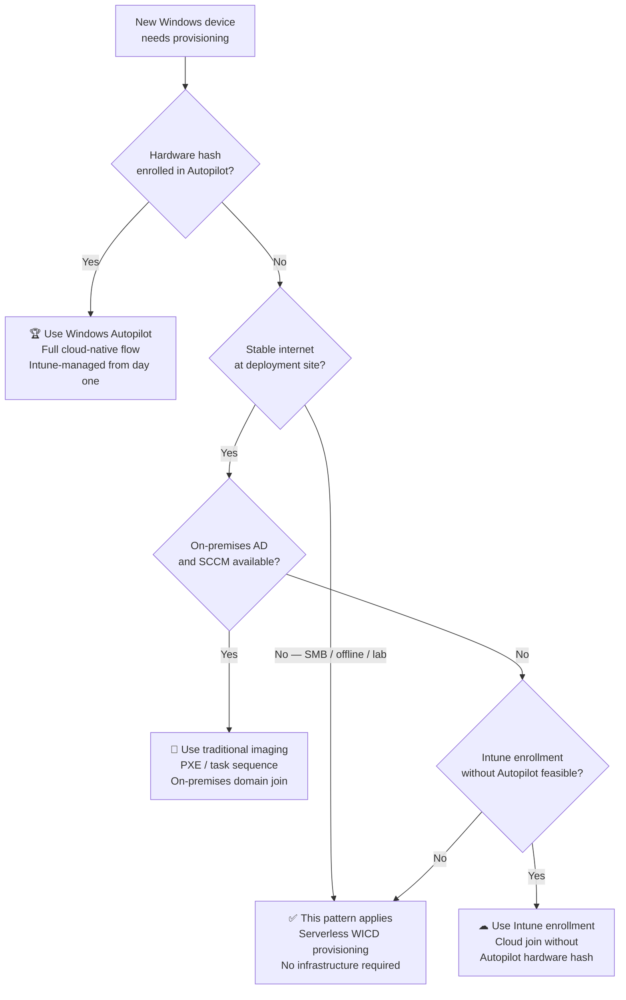

# Serverless Windows Provisioning with WICD

This project documents a **serverless Windows provisioning pattern** built using **Windows Imaging and Configuration Designer (WICD)**. It is intended for scenarios where full cloud-based provisioning (like Autopilot) is unnecessary, unavailable, or excessive.

The solution enables secure, repeatable provisioning of **Windows 10 and Windows 11 devices** using only native Windows tooling, without deployment servers, imaging infrastructure, or long-running agents.

---

## Why This Project Exists

Provisioning Windows devices is often framed as a binary choice:

1. Traditional imaging infrastructure (servers, AD, SCCM)  
2. Fully cloud-native provisioning (Autopilot, Intune)

In reality, many environments sit in between, or intentionally avoid adding infrastructure. This pattern demonstrates how to prepare devices **securely and consistently** in such contexts.

---

## Core Challenge

Typical provisioning assumes:

- Deployment servers
- Directory services
- Persistent management infrastructure

This solution asks a different question:

> **What if none of that exists?**

The goal is to provision devices **quickly, securely, and reliably** using only the platform’s native capabilities.

---

## How It Works (High-Level)

1. A provisioning package (`.ppkg`) defines system configuration, security settings, and application installs  
2. Devices boot from prepared installation media (USB)  
3. Users complete **Entra ID (Azure AD) join** during setup  
4. Security controls such as **BitLocker**, VPN, Wi-Fi, and compliance settings are applied automatically  
5. Device reaches a **compliant and usable state** without manual intervention  

> No deployment servers  
> No imaging pipelines  
> No long-running agents  

---

## Where This Is Useful

This solution is ideal for scenarios such as:

- Small offices or labs with a few workstations that need **Workgroup or offline deployment**  
- Preparing computers for **training environments or workshops**, where domain join may not be needed  
- Organizations or projects that require **offline, low-cost, serverless provisioning**  
- Transitional scenarios before adopting modern cloud platforms like Autopilot  

> For fully cloud-managed deployments (AAD + Intune), Autopilot remains the preferred approach. WICD still provides value for offline or constrained setups, or when bulk provisioning without backend services is desired.

---

## When to Use This Pattern

---

## Security Perspective

- **Encryption** is enabled during deployment  
- **Recovery keys** are backed up to Entra ID using native platform trust  
- Scripts operate within Windows security boundaries  
- **No secrets or credentials** are embedded in artifacts  
- Provisioning is treated as a **security control**, not just a setup task  
