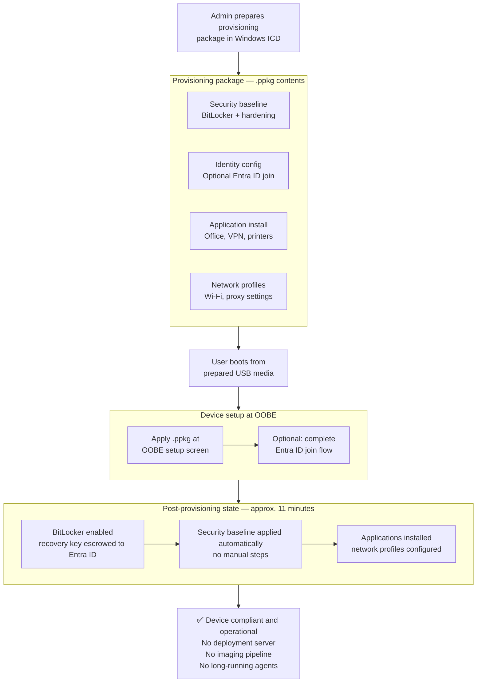

# Serverless Windows Provisioning – WICD Approach

## Context

Windows provisioning is typically framed as a binary choice: traditional imaging
infrastructure (Active Directory, SCCM, PXE boot) or fully cloud-native provisioning
(Autopilot, Intune). Many environments fall between those options — small offices,
training labs, transitional scenarios, or deployments where the cost of adding
backend infrastructure exceeds the value it provides.

This pattern documents a third path: provisioning Windows 10/11 devices securely
and repeatably using only native Windows tooling, with no deployment servers,
imaging pipelines, or long-running agents.

The mechanism is a provisioning package (`.ppkg`) built with Windows Imaging and
Configuration Designer (WICD). The package encodes security baseline, identity
configuration, and application install logic and applies it at OOBE. Devices
reach a compliant, usable state within approximately 11 minutes of first boot.

---

## Provisioning Flow

---

## Where This Applies

**Small offices and labs (5–20 workstations)**  
Full provisioning and application installation without IT infrastructure. Devices
can remain Workgroup joined or optionally join Entra ID.

**Training environments and temporary workstations**  
Rapid reprovisioning with consistent security controls and baseline applications
between cohorts. No dependency on AD, SCCM, or cloud enrollment.

**Transitional environments**  
Devices provisioned this way can later integrate into cloud management (Autopilot,
Intune). Entra ID join via WICD is optional but supported.

---

## Security Characteristics

- BitLocker enabled during provisioning; recovery key escrowed to Entra ID
- No secrets or credentials embedded in provisioning artifacts
- All configuration applies through native Windows security boundaries
- Post-provisioning state is auditable from logs and provisioning artifacts

---

## Operational Notes

- Approximate provisioning time: ~11 minutes per device
- Users follow guided steps for booting from prepared USB media and completing
  optional Entra ID join
- Post-provisioning validation recommended: confirm security settings, application
  installation, and network access before handing off the device

---

## Where This Doesn't Apply

This pattern is not a replacement for Autopilot or full Intune enrollment. If
devices have hardware hashes enrolled and reliable internet connectivity at
deployment time, Autopilot is the better path. This pattern is for deployments
where those prerequisites don't exist.

Network-dependent features — cloud profile delivery, Intune baseline policies —
require additional configuration and connectivity after provisioning. This pattern
gets the device to a secure baseline; it does not substitute for a management plane.
