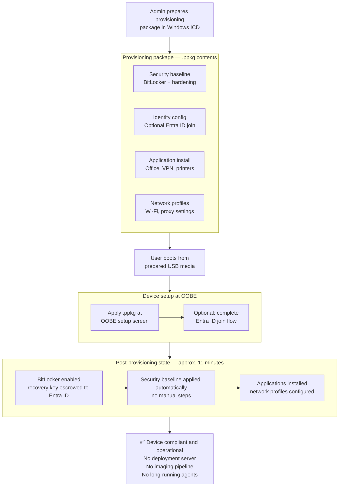

# Serverless Windows Provisioning – WICD Approach

For background on the pattern, the problem it addresses, and when to use it,
see the [pattern README](../README.md).

This document covers the provisioning flow in detail, what each component of
the provisioning package does at runtime, and operational notes.

---

## Provisioning Flow

---

## Provisioning Package Contents

The `.ppkg` is the core artifact. It is built once in Windows Imaging and
Configuration Designer (WICD) and reused across devices. The four content
categories in the diagram correspond to the following runtime behaviors.

**Security baseline: BitLocker + hardening**  
BitLocker encryption is enabled automatically during OOBE. The recovery key
is escrowed to Entra ID as part of the provisioning sequence, provided the
device completes the optional Entra ID join step. Security hardening settings
(password policy, audit policy, Windows Firewall) are applied through the
provisioning runtime without requiring Group Policy or Intune.

**Identity config: Optional Entra ID join**  
The package can embed a bulk enrollment token, enabling hands-free Entra ID
join during setup. Alternatively, the user completes the join step manually
during OOBE. Both paths produce a managed device without requiring IT presence
at the machine.

**Application install: Office, VPN, printers**  
MSI packages, scripts, and certificate installations are delivered natively
within the WICD provisioning sequence. Applications are present before the
user reaches the desktop.

**Network profiles: Wi-Fi, proxy settings**  
Wi-Fi credentials and proxy configurations embedded in the package are applied
during OOBE, ensuring connectivity is available from first sign-in, including
for the optional Entra ID join step that requires it.

---

## Operational Notes

- Approximate provisioning time: ~11 minutes per device
- Users follow guided steps for booting from prepared USB media and completing
  the optional Entra ID join
- Post-provisioning validation recommended: confirm BitLocker status, application
  installation, and network access before handing off the device

---

## Where This Doesn't Apply

This pattern is not a replacement for Autopilot or full Intune enrollment. If
devices have hardware hashes enrolled and reliable internet connectivity at
deployment time, Autopilot is the better path. This pattern is for deployments
where those prerequisites don't exist.

Network-dependent features (cloud profile delivery, Intune baseline policies)
require additional configuration and connectivity after provisioning. This pattern
gets the device to a secure baseline; it does not substitute for a management plane.
