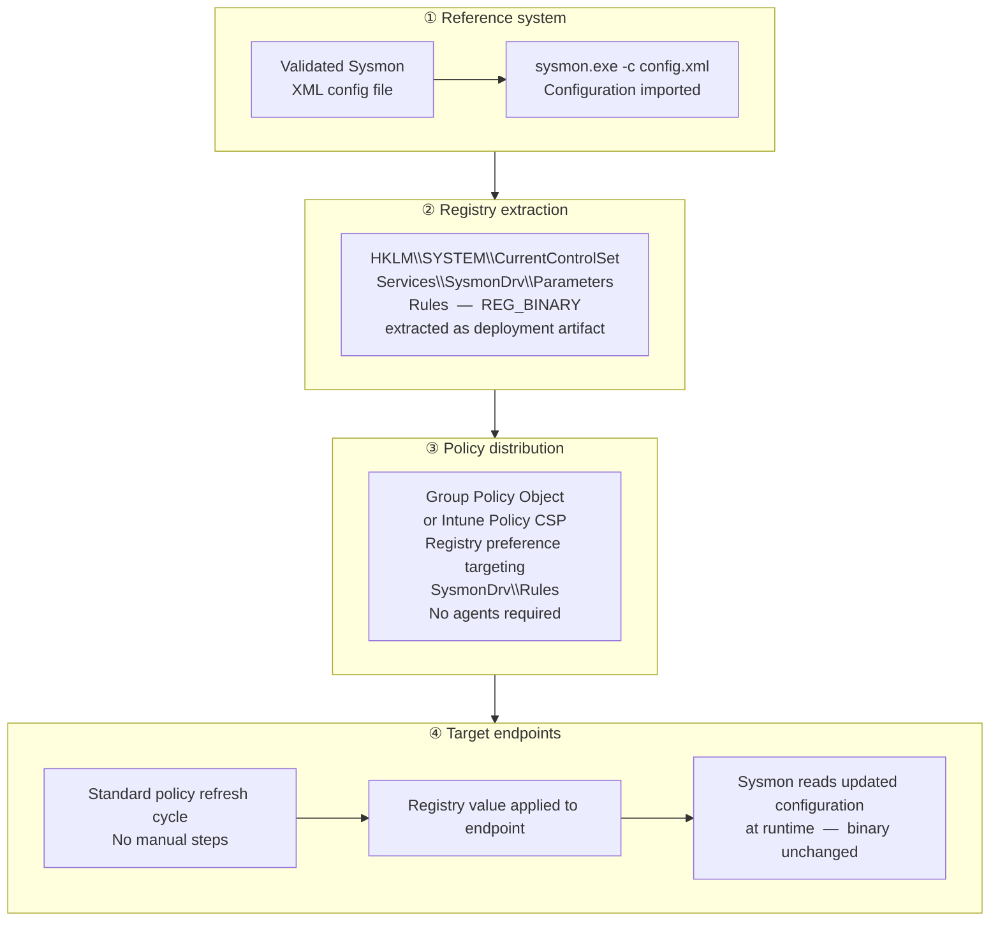

# Registry-Based Sysmon Configuration Deployment

## Background

Sysmon is a host-based telemetry tool that extends native Windows event logging
with detailed visibility into process execution, network connections, file system
activity, and other system behaviors.

While the Sysmon binary itself is typically deployed once and remains stable,
its **configuration** defines what is observed and how events are generated.
Detection strategies evolve over time — in response to new threats, operational
changes, and tuning requirements — making Sysmon configuration a living artifact
that requires ongoing updates.

In many environments, configuration updates are bundled with the Sysmon binary
and delivered through software deployment pipelines. While functional, this
creates **unnecessary coupling** between binary lifecycle management and
configuration changes, slowing down detection iteration.

---

## Key Observation

When a Sysmon XML configuration is imported, Windows **persists the compiled
configuration to the registry**:

- **Key:** `HKLM\SYSTEM\CurrentControlSet\Services\SysmonDrv\Parameters`
- **Value:** `Rules`
- **Type:** `REG_BINARY`

Sysmon reads from this registry representation at runtime — not from the
original XML file.

This behavior makes it possible to **manage Sysmon configuration independently
from the Sysmon binary**, using native Windows policy delivery mechanisms.

---

## Solution Overview

This pattern decouples Sysmon configuration delivery from binary deployment
by treating the registry-backed configuration as the authoritative artifact
and distributing it via centralized policy.

### High-Level Flow

---

## Technical Design

### 1. Reference System Import

A validated Sysmon XML configuration is loaded on a controlled reference machine
using `sysmon.exe -c <config.xml>`. This confirms the configuration is
syntactically correct and behaviorally intentional before extraction and
distribution.

### 2. Registry Value Extraction

After import, the compiled configuration is present in the registry as a
`REG_BINARY` value. This value is exported and becomes the deployment artifact —
replacing the XML file in downstream distribution.

`Export-SysmonRegistryConfig.ps1` performs this step: it reads the `Rules` value,
writes a `.reg` file in standard regedit format, and outputs a SHA-256 hash for
version tracking. See [docs/registry-based-sysmon-config.md](docs/registry-based-sysmon-config.md)
for usage guidance and GPO deployment field values.

### 3. Policy Object Definition

The binary registry value is embedded in a Group Policy Object (or equivalent
native policy mechanism) targeting the `SysmonDrv\Parameters\Rules` path.
No additional tooling or agents are required.

### 4. Endpoint Delivery

Target systems receive configuration updates automatically during standard policy
refresh cycles. No manual intervention, software redeployment, or endpoint
connectivity beyond normal policy infrastructure is required.

---

## Repository Contents

- `scripts/Export-SysmonRegistryConfig.ps1`  
  Extracts the compiled Sysmon configuration from the registry on a reference
  system and writes it as a `.reg` file ready for GPO configuration. Optionally
  imports a Sysmon XML configuration before extraction.

- `docs/`  
  Detailed documentation covering the registry model, step-by-step approach,
  benefits, and operational considerations

---

## Considerations

- Configurations should be validated on a reference system before policy distribution
- Improper configuration may increase event volume or affect endpoint performance
- Binary registry values grow with configuration complexity; large configurations
  may marginally affect policy refresh duration
- Version tracking and change control for configuration artifacts is recommended

---

## Disclaimer

This pattern is provided as reference material and design guidance. Implementations
may require adaptation based on environment, Sysmon version, and policy infrastructure.

Validate all configurations in a controlled test environment before production use.

---

## Key Takeaway

Sysmon's registry-backed configuration model allows detection logic to be updated
at policy cadence — independently of the binary deployment lifecycle — using only
native Windows mechanisms.

This decoupling accelerates detection iteration while reducing operational overhead
and avoiding unnecessary changes to the software deployment pipeline.
