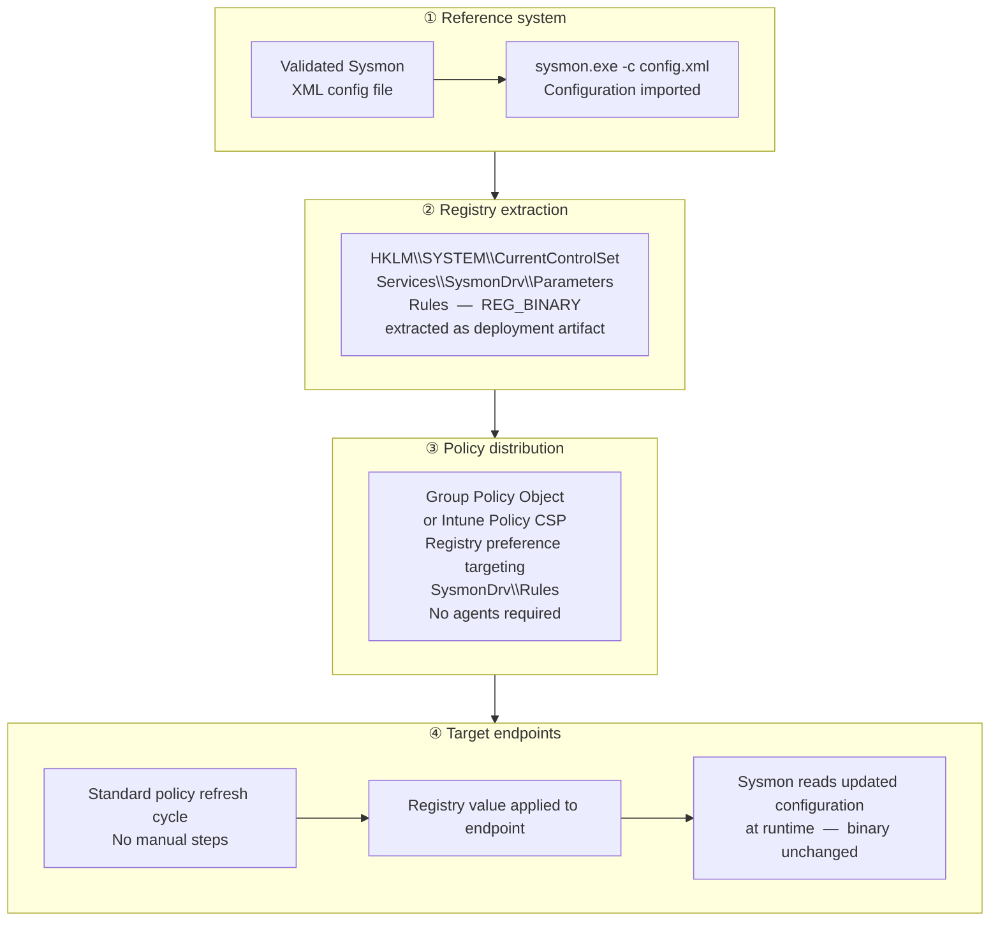

# Registry-Based Sysmon Configuration via Native Policy

## Context

Sysmon is a host-based telemetry tool that extends native Windows logging by providing detailed visibility into process execution, network activity, and other system behaviors. While the Sysmon binary itself is typically deployed once and remains stable over long periods, its configuration defines what is observed and how events are generated. As detection strategies evolve in response to new threats, environmental changes, and operational priorities, Sysmon configuration requires periodic updates to remain effective and relevant.

In many environments, configuration updates are delivered alongside the Sysmon binary through deployment mechanisms. While functional, this approach can introduce unnecessary coupling between binary lifecycle management and configuration changes.

This document describes a pattern that decouples Sysmon configuration delivery from binary deployment by leveraging Sysmon’s registry-backed configuration model and native Windows policy mechanisms.

---

## Key Observation

When a Sysmon configuration is imported, the effective configuration is persisted locally in the Windows registry. Sysmon consumes this registry-backed representation at runtime rather than continuously referencing the original XML configuration file.

Understanding this behavior allows configuration management to be approached independently from software deployment.

---

## Registry Location

Sysmon configuration rules are stored at:

- **Registry Key**  
  `HKLM\SYSTEM\CurrentControlSet\Services\SysmonDrv\Parameters`

- **Value Name**  
  `Rules`

- **Value Type**  
  `REG_BINARY`

The `Rules` value contains the compiled representation of the Sysmon configuration.

---

## High-Level Approach

This pattern leverages Sysmon's registry-backed configuration mechanism and native policy delivery to maintain consistent endpoint telemetry.

### Approach Steps

**Step Details:**

1. **Import configuration on reference system**  
   - A tested Sysmon XML is loaded to ensure all rules work correctly.

2. **Extract registry value**  
   - The imported configuration is persisted in the binary registry value `HKLM\SYSTEM\CurrentControlSet\Services\SysmonDrv\Parameters\Rules`.

3. **Create centralized policy object**  
   - Define this registry value in a Group Policy Object or equivalent policy mechanism for consistent distribution.

4. **Deliver to endpoints**  
   - Target systems automatically apply updates during standard policy refresh cycles, removing reliance on manual or package-based deployments.

**Summary:** Test once, extract from the registry, distribute via policy, and let endpoints apply updates automatically.

---

## Benefits

Adopting this pattern provides several advantages:

- **Decoupled lifecycles**  
  Sysmon binaries and configuration can be managed independently

- **Improved consistency**  
  Configuration delivery leverages reliable, existing policy refresh mechanisms

- **Faster iteration**  
  Detection logic can be updated without waiting for software redeployment cycles

- **Reduced operational overhead**  
  Fewer moving parts in the deployment process

---

## Considerations

- Configuration should be validated prior to policy distribution
- Improper configuration may increase event volume or resource usage
- Change control and version tracking of configuration data is recommended

### Performance and Policy Considerations

This approach leverages centralized policy refresh to deliver Sysmon configuration updates via the registry. Since the Sysmon configuration is stored as a **binary registry value**, the size of this value grows with the number and complexity of rules, filters, and parameters defined in the configuration.

As a result:

- On systems targeted by multiple policies, or when the registry value is particularly large, policy processing and refresh operations may take longer than usual.
- This effect is a natural consequence of registry-backed configuration delivery and is not specific to Sysmon itself.

While typically transient, this behavior should be considered when planning large-scale deployments or frequent configuration updates. Administrators should balance the level of detail in the Sysmon configuration with operational considerations for policy application performance.

---

## Summary

By leveraging Sysmon’s registry-backed configuration model and native policy delivery, this pattern enables more agile and reliable configuration management while remaining aligned with standard Windows operational practices.